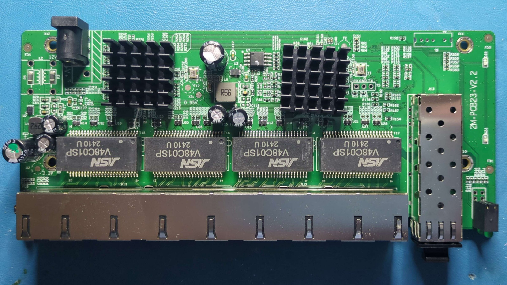

### 2M-PCB23-V2.2

## Brands
| Brand    | Type            | Managed | PCB           | Flash | Chip RTL    |
|----------|-----------------|---------|---------------|-------|-------------|
| keepLINK | KP-9000-9XHML-X | Yes     | 2M-PCB23-V2.2 | 2M    | 8373 + 8224 |

## PCB



## Port overview

```
┌─────────────────────────────────────────────────────────────────────────────────────────────────────────────────────────────┐
│                                                                                                       ┌──────────┐          │
│     ┌─────────┐ ┌─────────┐ ┌─────────┐ ┌─────────┐ ┌─────────┐ ┌─────────┐ ┌─────────┐ ┌─────────┐   │ SFP(J13) │          │
│     │  RJ45   │ │  RJ45   │ │  RJ45   │ │  RJ45   │ │  RJ45   │ │  RJ45   │ │  RJ45   │ │  RJ45   │   │ PORT   9 │          │
│     │  PORT 1 │ │  PORT 2 │ │  PORT 3 │ │  PORT 4 │ │  PORT 5 │ │  PORT 6 │ │  PORT 7 │ │  PORT 8 │   │ MAC    8 │ O (PWR)  │
│  O  │  MAC  0 │ │  MAC  1 │ │  MAC  2 │ │  MAC  3 │ │  MAC  4 │ │  MAC  5 │ │  MAC  6 │ │  MAC  7 │   │ SerDes 1 │ O (SFP)  │
│ RST └─────────┘ └─────────┘ └─────────┘ └─────────┘ └─────────┘ └─────────┘ └─────────┘ └─────────┘   └──────────┘          │
└─────────────────────────────────────────────────────────────────────────────────────────────────────────────────────────────┘
```

# Connectors

### J13, SFP connector

| SFP Pin | Signal            | GPIO   | Notes                          |
| ------- | ----------------- | ------ | ------------------------------ |
| 2       | TX_FAULT          | ??     |                                |
| 3       | TX_DISABLE        | ??     |                                |
| 4       | MODDEF2 – SDA     | GPIO39 |                                |
| 5       | MODDEF1 – SCL     | GPIO40 |                                |
| 6       | MODDEF0 – PRESENT | GPIO30 | "OE Exist" reported by `fiber` |
| 7       | RATE SEL          | ??     |                                |
| 8       | LOS	              | GPIO37 | "OE LOS" reported by `fiber`   |
| 9       | TO?               | ??     |                                |

### T5, serial console

| pin | GPIO   | Signal         |
| --- | ------ | -------------- |
| 1   | GPIO32 | U0RXD (Input)  |
| 2   | GND    | Ground         |
| 3   | GPIO31 | U0TXD (Output) |

### S1, unknown connector

| pin | GPIO     | Signal         |
| --- | -------- | -------------- |
| 1   | ???      |                |
| x   |          |                |
| 3   | ???      |                |
| 4   | ???      |                |
| 5   | ???      |                |

Potentially slave interface or SMI.

### U7, flash memory

Flash chip is FM25Q16A.

### Reset button

GPIO54

## Register values

As probed with `regget` on stock firmware "V1.6".

### Model

| Name                      | Addr   | Value      |
| ------------------------- | ------ | ---------- |
| MODEL_NAME_INFO           | 0x0004 | 0x83730000 |
| CHIP_MODE_INFO            | 0x0008 | 0x00008000 |
| CHIP_INFO                 | 0x000C | 0x00300000 |

### GPIO

| Name                      | Addr   | Value      |
| ------------------------- | ------ | ---------- |
| GPIO_OUT0                 | 0x003c | 0x10000000 |
| GPIO_OUT1                 | 0x0040 | 0x00000010 |
| GPIO_OE0                  | 0x004c | 0x10000000 |
| GPIO_OE1                  | 0x0050 | 0x00000010 |
| BOND_INFO                 | 0x7f60 | 0x00000fff |
| STRAP_INFO                | 0x7f64 | 0x0002f515 |
| IO_DRVING_0               | 0x7f68 | 0x00000000 |
| IO_DRVING_1               | 0x7f6c | 0x00000000 |
| IO_DRVING_2               | 0x7f70 | 0x00000000 |
| IO_SLEW_0                 | 0x7f74 | 0x00000000 |
| IO_SLEW_1                 | 0x7f78 | 0x00000000 |
| IO_SLEW_2                 | 0x7f7c | 0x00000000 |
| IO_SMT_EN_0               | 0x7f80 | 0xffffffff |
| IO_SMT_EN_1               | 0x7f84 | 0xffffffff |
| IO_SMT_EN_2               | 0x7f88 | 0x0003ffff |
| IO_MUX_SEL_0              | 0x7f8c | 0x28000000 |
| IO_MUX_SEL_1              | 0x7f90 | 0x40000041 |
| IO_MUX_SEL_2              | 0x7f94 | 0x00000000 |

### LED

| Name                      | Addr   | Value      |
| ------------------------- | ------ | ---------- |
| LED_GLB_CTRL              | 0x6520 | 0x0023e0f0 |
| LED3_0_SET3_2_CTRL1       | 0x6524 | 0xff001400 |
| LED3_0_SET1_0_CTRL1       | 0x6528 | 0x000f0000 |
| LED3_2_SET3_CTRL0         | 0x652c | 0x007f013f |
| LED1_0_SET3_CTRL0         | 0x6530 | 0x02000400 |
| LED3_2_SET2_CTRL0         | 0x6534 | 0x01400141 |
| LED1_0_SET2_CTRL0         | 0x6538 | 0x01440170 |
| LED3_2_SET1_CTRL0         | 0x653c | 0x18000041 |
| LED1_0_SET1_CTRL0         | 0x6540 | 0x0044017f |
| LED3_2_SET0_CTRL0         | 0x6544 | 0x00000044 |
| LED1_0_SET0_CTRL0         | 0x6548 | 0x00410175 |
| LED_PORT_SET_SEL_CTRL     | 0x654c | 0x00010000 |
| SW_LED_LOAD               | 0x6550 | 0x00000000 |
| LED_PORT_SW_EN_CTRL[0..7] | 0x6554 | 0x00000000 |
| LED_PORT_SW_EN_CTRL[8]    | 0x6558 | 0x00000000 |
| LED_PORT_SW_CTRL[0]       | 0x655c | 0x00000000 |
| LED_PORT_SW_CTRL[1]       | 0x6560 | 0x00000000 |
| LED_PORT_SW_CTRL[2]       | 0x6564 | 0x00000000 |
| LED_PORT_SW_CTRL[3]       | 0x6568 | 0x00000000 |
| LED_PORT_SW_CTRL[4]       | 0x656c | 0x00000000 |
| LED_PORT_SW_CTRL[5]       | 0x6570 | 0x00000000 |
| LED_PORT_SW_CTRL[6]       | 0x6574 | 0x00000000 |
| LED_PORT_SW_CTRL[7]       | 0x6578 | 0x00000000 |
| LED_PORT_SW_CTRL[8]       | 0x657c | 0x00000000 |
| LED_LOAD_LV1_10G          | 0x6580 | 0x000fa000 |
| LED_LOAD_LV2_10G          | 0x6584 | 0x00271000 |
| LED_LOAD_LV3_10G          | 0x6588 | 0x004e2000 |
| LED_LOAD_LV1_5G           | 0x658c | 0x000fa000 |
| LED_LOAD_LV2_5G           | 0x6590 | 0x00271000 |
| LED_LOAD_LV3_5G           | 0x6594 | 0x004e2000 |
| LED_LOAD_LV1_2P5G         | 0x6598 | 0x000fa000 |
| LED_LOAD_LV2_2P5G         | 0x659c | 0x00271000 |
| LED_LOAD_LV3_2P5G         | 0x65a0 | 0x004e2000 |
| LED_LOAD_LV1_1G           | 0x65a4 | 0x000fa000 |
| LED_LOAD_LV2_1G           | 0x65a8 | 0x00271000 |
| LED_LOAD_LV3_1G           | 0x65ac | 0x004e2000 |
| LED_LOAD_LV1_500M         | 0x65b0 | 0x0007d000 |
| LED_LOAD_LV2_500M         | 0x65b4 | 0x00138800 |
| LED_LOAD_LV3_500M         | 0x65b8 | 0x00271000 |
| LED_LOAD_LV1_100M         | 0x65bc | 0x00019000 |
| LED_LOAD_LV2_100M         | 0x65c0 | 0x0003e800 |
| LED_LOAD_LV3_100M         | 0x65c4 | 0x0007d000 |
| LED_LOAD_LV1_10M          | 0x65c8 | 0x00002800 |
| LED_LOAD_LV2_10M          | 0x65cc | 0x00006400 |
| LED_LOAD_LV3_10M          | 0x65d0 | 0x0000c800 |
| LED_P_LOAD_CTRL           | 0x65d4 | 0x00000000 |
| LED_GLB_ACTIVE            | 0x65d8 | 0x3ffbedff |
| LED_GLB_IO_EN             | 0x65dc | 0x77ffffff |
| LED_GLB_MUX_1             | 0c65e0 | 0x05102040 |
| LED_GLB_MUX_2             | 0x65e4 | 0x0c289206 |
| LED_GLB_MUX_3             | 0x65e8 | 0x1245038d |
| LED_GLB_MUX_4             | 0x65ec | 0x19616554 |
| LED_GLB_MUX_5             | 0x65f0 | 0x2079d71a |
| LED_GLB_MUX_6             | 0x65f4 | 0x000238a1 |
| LED_RLDP_CTRL_1           | 0x65f8 | 0x00000019 |
| LED_RLDP_CTRL_2           | 0x65fc | 0xffffffff |
| LED_RLDP_CTRL_3           | 0x6600 | 0x00006600 |
| LED_DUMY_0_ADDR           | 0x6604 | 0x00000000 |
| LED_DUMY_1_ADDR           | 0x6608 | 0x00000000 |

# LEDs

| Name                          | Components                  | Controlled by              |
| ----------------------------- | --------------------------- | -------------------------- |
| RJ45 Right Green ("LINK/ACT") |                             | RJ45 LED0                  |
| RJ45 Left Orange ("2.5G")     |                             | RJ45 LED1                  |
| RJ45 Left Green  ("1G")       |                             | RJ45 LED2                  |
| "P" (PWR)                     | Top LED in "LED6" stack     | probably pulled from Vcc   |
| SFP Link ("9")                | Bottom LED in "LED6" stack  | SFP LED0                   |
| ??                            | D23                         | SFP LED1                   |
| ??                            | D22                         | SFP LED2                   |
