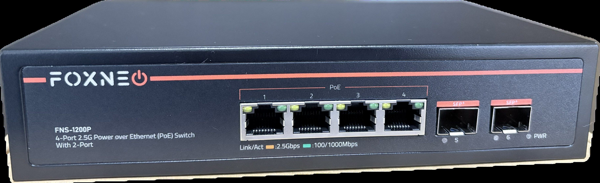
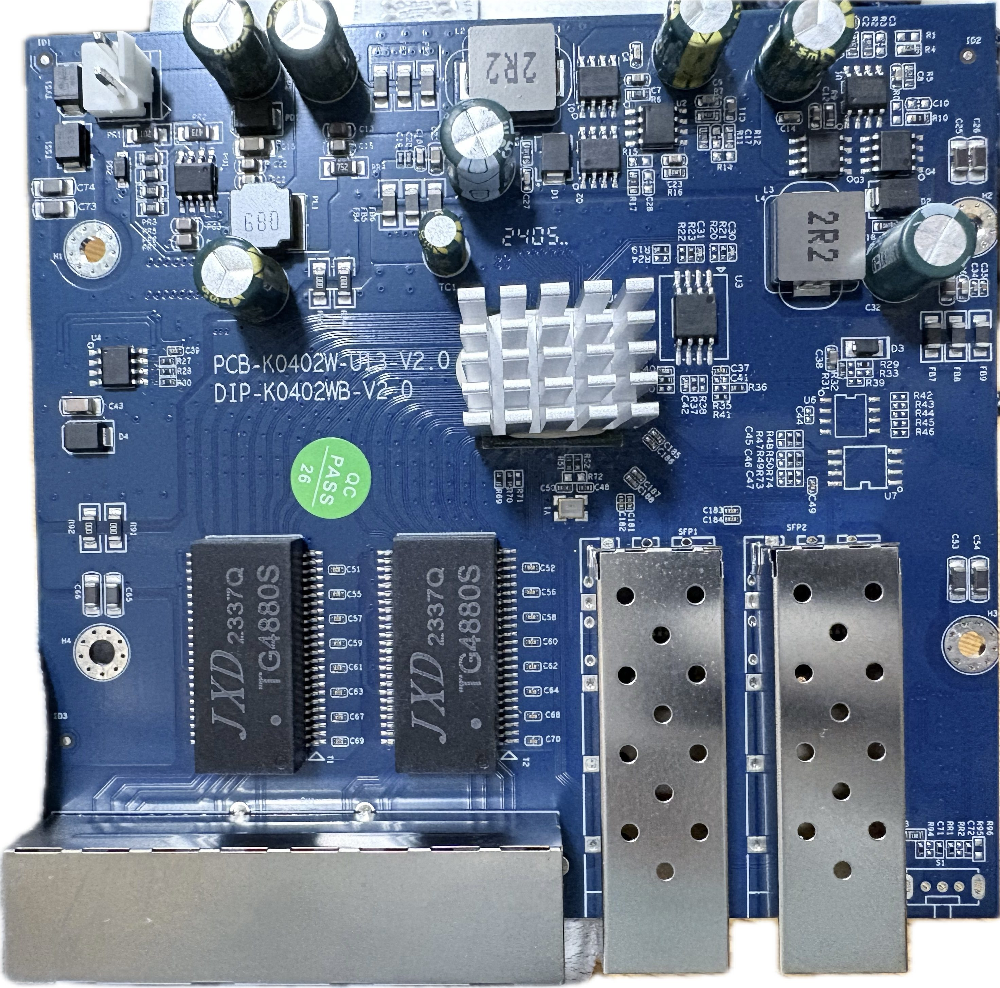

# FOXNEO FNS-1200P

RTL8372-based 4×2.5G PoE+ + 2×SFP+ unmanaged switch.

Using SPI clamp in-board is the only method for initial installation.

### Label specifications

- **Manufacturer**: FOXNEO
- **Model**: FNS-1200P
- **Ports**:
  - 4 × RJ45: 10/100/1000/2500 Mbps with PoE+
  - 2 × SFP+: 1G / 2.5G / 10G

### What works

- All four 2.5GBASE-T RJ45 ports at 10/100/1000/2500 Mbps (PoE+ is not configurable via RTLPlayground)
- Both SFP+ ports supporting 1G, 2.5G and 10G modules
- LEDs: amber (2.5G) and green (1G/100M/10M) per copper port; combined link/act on SFP ports

### PCB overview

**Board markings**
- Top silkscreen: PCB-K0402W-U13-V2.0 / DIP-K0402WB-V2.0

**Key components**
- U3: SPI NOR flash, 2 MiB
- U7: unpopulated SOP8 footprint — I2C bus (RTL8372 slave at 0x5c) is accessible from its pads, useful for register dumps
- S1: unpopulated slide switch footprint (three through-holes used as serial console)

Front panel

Top side (PCB)

### Port layout

| Front panel position | Logical port | Physical port | Type    |
|----------------------|--------------|---------------|---------|
| SFP left             | 8            | 5             | SFP+    |
| RJ45 1               | 4            | 1             | Copper  |
| RJ45 2               | 5            | 2             | Copper  |
| RJ45 3               | 6            | 3             | Copper  |
| RJ45 4               | 7            | 4             | Copper  |
| SFP right            | 3            | 6             | SFP+    |

### Serial console

The PCB has three unpopulated through-holes intended for a slide switch, directly connected to UART0.
Numbered from the left (SFP port side), the pinout is:

| Position (left→right) | Signal | GPIO                     |
|-----------------------|--------|--------------------------|
| 1 (leftmost)          | RX     | GPIO32\_UART0\_RX (32)   |
| 2 (middle)            | GND    | GND                      |
| 3 (rightmost)         | TX     | GPIO31\_UART0\_TX (31)   |

- **Settings**: 115200 baud / 8N1 / 3.3V TTL
- Connect a USB-TTL adapter: adapter TX → pin 1, GND → pin 2, adapter RX → pin 3

### LED configuration

Copper ports use LED SET0, SFP ports use LED SET1.

| SET  | LED0                                             | LED2                                              |
|------|--------------------------------------------------|---------------------------------------------------|
| SET0 | Amber — lights on 2.5G link                      | Green — lights on 1G / 100M / 10M link            |
| SET1 | All speeds — lights on any link with activity    | —                                                 |

LED pad to physical port mapping:

| GPIO pads | Port                    |
|-----------|-------------------------|
| GPIO8–11  | Physical port 5 (left SFP)  |
| GPIO12–14 | Physical port 1 (RJ45 1)    |
| GPIO15–17 | Physical port 2 (RJ45 2)    |
| GPIO18–20 | Physical port 3 (RJ45 3)    |
| GPIO21–23 | Physical port 4 (RJ45 4)    |
| GPIO24–27 | Physical port 6 (right SFP) |

### SFP GPIO assignments

| SFP              | pin\_detect (ModAbs)        | pin\_los               | SerDes | I2C SDA              | I2C SCL                  |
|------------------|-----------------------------|------------------------|--------|----------------------|--------------------------|
| Left (logical 8) | GPIO30\_ACL\_BIT3\_EN       | GPIO37                 | SDS1   | GPIO39\_I2C\_SDA4    | GPIO40\_I2C\_SCL3\_MDC1  |
| Right (logical 3)| GPIO50\_I2C\_SCL2\_UART1\_TX | GPIO51\_I2C\_SDA2\_UART1\_RX | SDS0 | GPIO41\_I2C\_SDA3\_MDIO1 | GPIO40\_I2C\_SCL3\_MDC1 |

GPIO assignments were verified by observing GPIO state changes during SFP module insertion/removal
and cross-checked against an original firmware register dump.
`pin_tx_disable` is GPIO\_NA on both ports (original firmware keeps all GPIOs as inputs).
