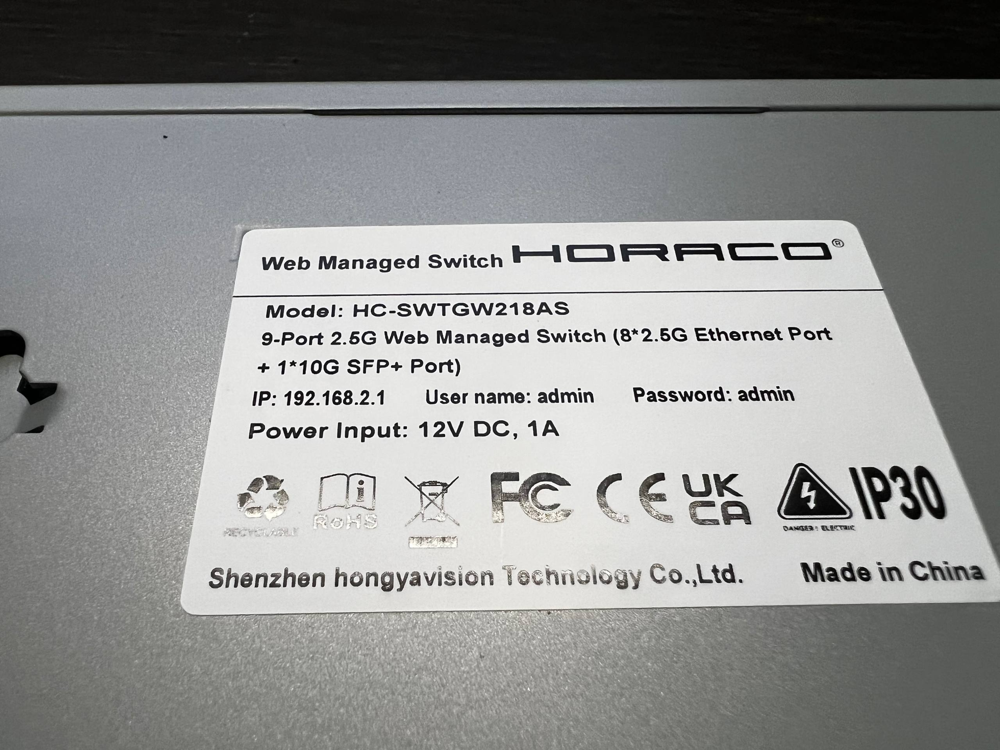
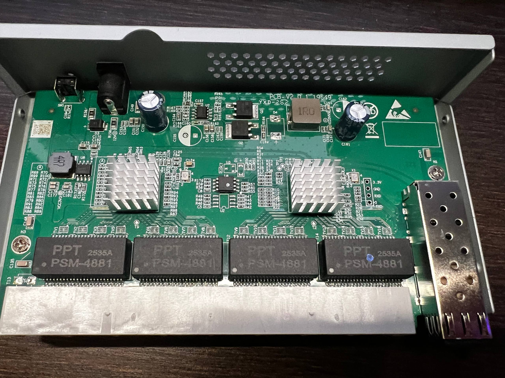

# Horaco HC-SWTGW218AS (PCB-V2.0.1_19649)

## Brands
| Brand  | Type           | Managed | PCB                             | Flash           | Chip RTL      |
|--------|----------------|---------|---------------------------------|-----------------|---------------|
| Horaco | HC-SWTGW218AS  | Yes     | HC-SWTGW218AS_PCB-V2.0.1_19649  | 2MB             | 8273N + 8224N |

This is the Horaco (Shenzhen hongyavision Technology Co., Ltd.) **HC-SWTGW218AS**
9-port 2.5G Web Managed switch. The PCB silkscreen reads
`HC-SWTGW218AS_PCB-V2.0.1_19649`.

**This is the same PCB as the [SWTG018AS-A V2.0](SWTG018AS_A_V2_0.md)** (sold
unmanaged under the Ampcom brand) — it shares the identical `..._19649` layout,
GPIO assignments, SFP wiring and LED routing. It is only re-branded and shipped
with managed firmware by Horaco. The RTLPlayground machine definition
`MACHINE_HC_SWTGW218AS_PCB_V2` in `machine.c` is therefore a copy of
`MACHINE_SWTG018AS_A_V_2_0`.

> **Do not confuse this with `MACHINE_SWTGW218AS`.** That definition targets the
> different **SWTG118AS** PCB (as used by Mokerlink ZX-SWTGW218AS / XikeStor
> SKS3200-8E1X, see [SWTGW218AS.md](SWTGW218AS.md)), which has different SFP and
> reset GPIO assignments. Using the wrong definition results in wrong LEDs and a
> non-working SFP port.

## Building for this device

In `machine.h`, select:

```c
#define MACHINE_HC_SWTGW218AS_PCB_V2
```

(and make sure the other `MACHINE_*` defines are commented out.)

## Label specifications

- **Vendor**: HORACO — Shenzhen hongyavision Technology Co., Ltd.
- **Model**: HC-SWTGW218AS
- **Name**: 9-Port 2.5G Web Managed Switch
- **Ports**:
  - 8 × RJ45: 10/100/1000/2500 Mbps
  - 1 × SFP+: 1000 / 2500 / 10000 Mbps
- **Default management**: `192.168.2.1`, user `admin`, password `admin` (OEM firmware)
- **Power**: 12V DC, 1A barrel connector
- **Ratings**: FCC / CE / UKCA / RoHS, IP30



## What works

The device is fully supported (identical hardware to SWTG018AS-A V2.0):
- All 8 2.5GBASE-T RJ45 ports work at 10/100/1000/2500 Mbps
- The SFP+ port supports 1G, 2.5G and 10G modules
- LEDs work with the same indications as the OEM firmware
- VLANs tested and working

## PCB overview

**Board markings**
- Top silkscreen: `HC-SWTGW218AS_PCB-V2.0.1_19649` (also `YXD-262`)

Key components:
- **RTL8273N** switch SoC and **RTL8224N** 2.5GbE PHY (the two heatsinks)
- 4 × PPT `PSM-4881` Ethernet magnetics modules
- SFP+ cage on the right edge
- 12V DC barrel jack + on/off slide switch (SW1) on the left edge



### Serial console

A 4-pin serial header sits next to the SFP cage (silkscreened `3.3V / GND / RXD / TXD`).
The OEM firmware runs UART at **9600 baud**.

| Pin    | Signal       |
| ------ | ------------ |
| 3.3V   | 3V3          |
| GND    | GND          |
| RXD    | RX (Input)   |
| TXD    | TX (Output)  |

## Power supply

Input power is delivered via a barrel plug; a `12V 1A` adapter is provided.
