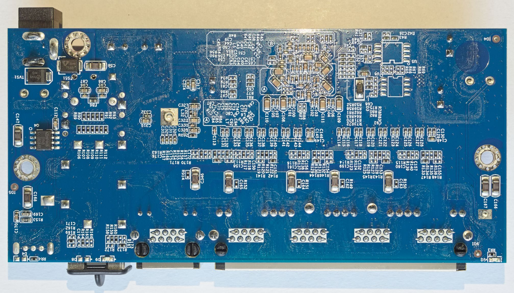

# K0501W

This board appears for example in the Davuaz Da-K6501W switch.

It is designed similarly to Hi-K0402WS. However, there are a few differences:
- One SFP port is replaced by a RTL8221B 2.5G PHY
- Only one LED is populated for the SFP port
- No mode switch and only one flash chip
- Like earlier revisions of the K0402W(S) board, there is no UART

Even though board looks very similar to K0402W(S), the actual GPIO and LED configuration is quite different.
All ports and LEDs are supported.

Installation is possible using a flash programmer.
The BoyaMicro 25Q16BSSIG flash chip is supported by flashprog with chip name "B.25D16AS/BY25Q16BS/BY25Q16ES".

## PCB pictures

The board is marked `PCB-K0501W-V2.0 DIP-K0501WS-V2.0`.

