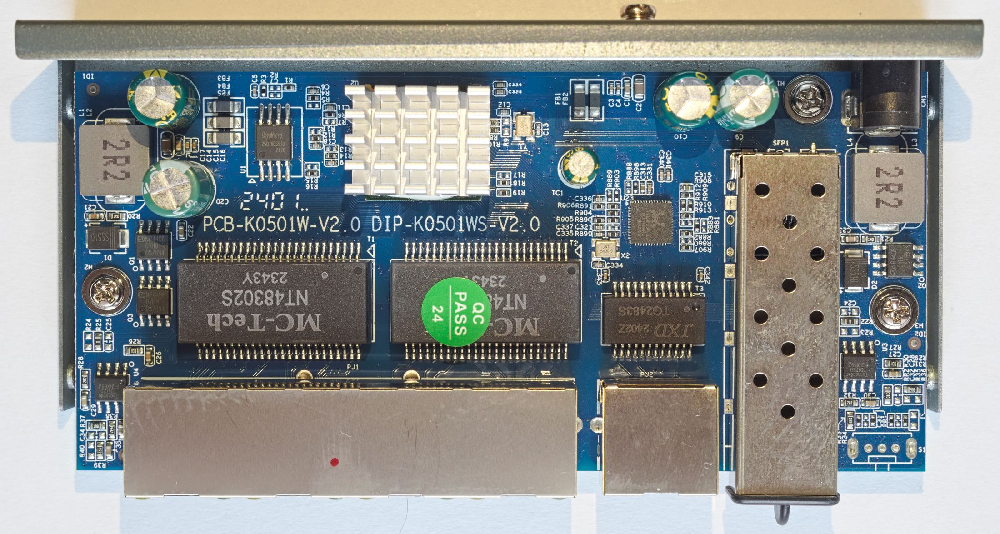

# K0501W V2.0

This board appears for example in the Davuaz Da-K6501W switch.

The general design of the board is similar to Hi-K0402WS V3.0.
However, there are several differences:
- One SFP port is replaced by a RTL8221B 2.5G PHY
- Only one LED is populated for the SFP port
- No mode switch and only one flash chip
- Older design using RTL8372 instead of RTL8372N (which also means different GPIO and LED configuration)
- Like earlier versions of the K0402W(S) board, there is no UART

All ports and LEDs are supported.
Installation is possible using a flash programmer.
The BoyaMicro 25Q16BSSIG flash chip is supported by flashprog with chip name "B.25D16AS/BY25Q16BS/BY25Q16ES".

## PCB pictures

The board is marked `PCB-K0501W-V2.0 DIP-K0501WS-V2.0`.

