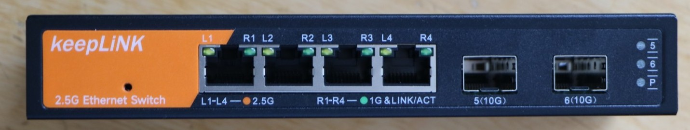
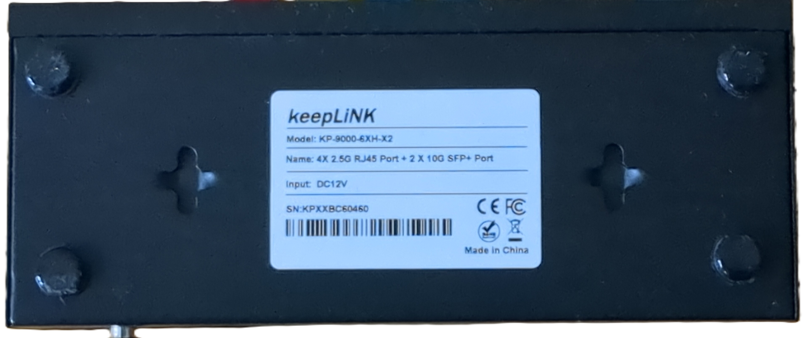
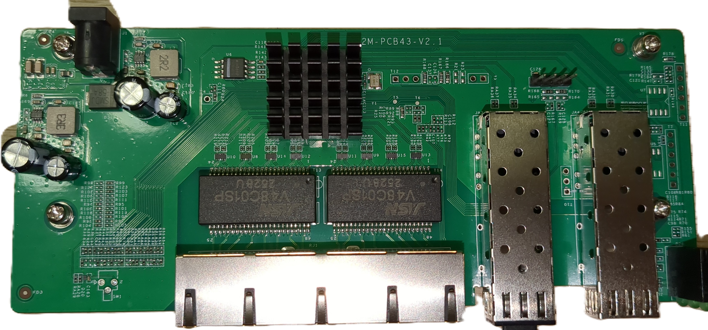
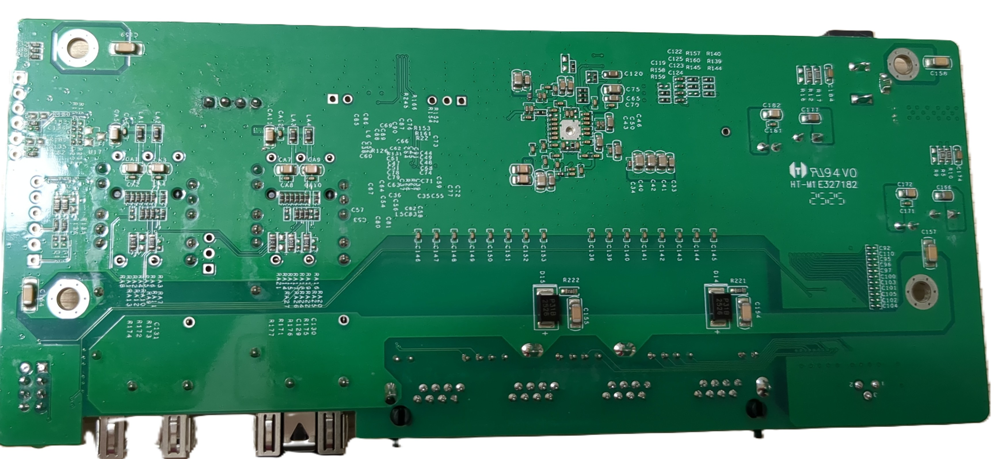
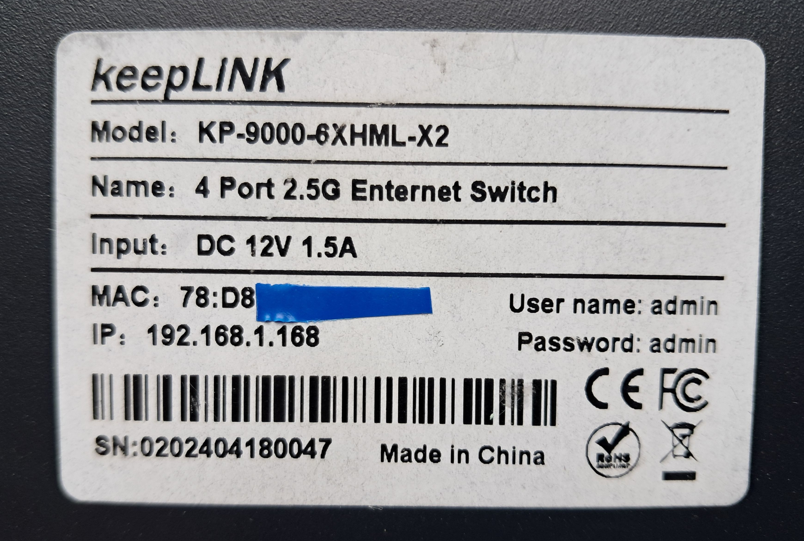
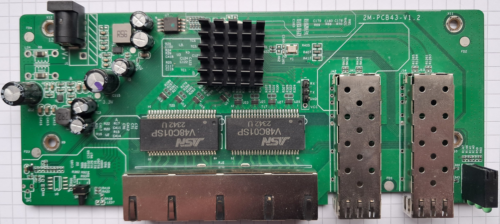
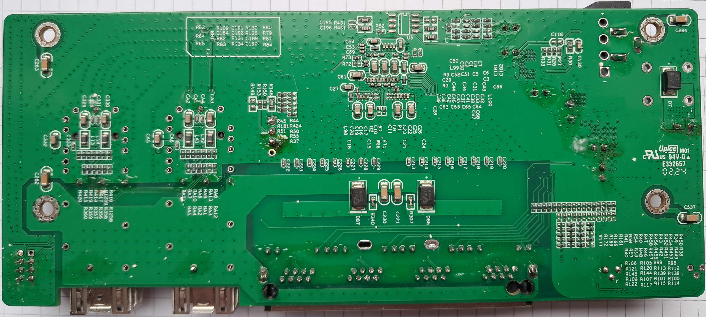

# Keeplink KP-9000-6XH-X2 / KP-9000-6XHML-X2

Following is documentation for switches marked as `KP-9000-6XH-X2` or
`KP-9000-6XHML-X2`.

Using SPI clamp in-board is the only method for initial installation.

### Label specifications

- **Name**: 4X 2.5G RJ45 Port + 2 X 10G SFP+ Port  
- **Model**: KP-9000-6XH-X2 / KP-9000-6XHML-X2
- **Ports**:  
  - 4 × RJ45: 10/100/1000/2500 Mbps  
  - 2 × SFP+: 1000 / 2500 / 10000 Mbps  

### Machine target

These devices exist with different PCB revisions. Select the machine target by
the PCB silkscreen, not only by the label on the case.

| PCB silkscreen | Known labels | Recommended machine target | Legacy target |
| --- | --- | --- | --- |
| `2M-PCB43-V1.2` | `KP-9000-6XHML-X2` | `MACHINE_KP_9000_6XHML_X2_V1_2` | `MACHINE_KP_9000_6XHML_X2` |
| `2M-PCB43-V2.1` | `KP-9000-6XH-X2`, `KP-9000-6XHML-X2` | `MACHINE_KP_9000_6XH_X2_V2_1` or `MACHINE_KP_9000_6XHML_X2_V2_1` | `MACHINE_KP_9000_6XH_X2` |

The V1.2 and V2.1 boards use different GPIO, SFP, port and LED mappings.
The unmanaged and managed labels are firmware/SKU differences and do not by
themselves identify the PCB wiring.

### What works

- All four 2.5GBASE-T RJ45 ports at 10/100/1000/2500 Mbps
- SFP port with 10G modules 
- LEDs
- untested due to missing Hardware: SFP+ ports equipped with 1G or 2.5G SFPs.

### Hardware overview: 2M-PCB43-V2.1

Front side:

Label:

### PCB overview

**Board markings**  
- Top silkscreen: 2M-PCB43-V2.1

Top side

Bottom

### Hardware overview: 2M-PCB43-V1.2

The V1.2 board has been seen in managed `KP-9000-6XHML-X2` devices.

Label:

Top side:

Bottom:

## Reset Button

There's an unpopulated Reset button on the front left side of the PCB.
It can easily be soldered, you'll need an 4.5mmx4.5mm 90° button switch with a 3-pin footprint.
I got mine here: https://de.aliexpress.com/item/1005007295346702.html
The front case has already the hole in the metal case, you just have to punch a hole through the foil.

## Power supply

Input power is delivered via barell plug, `12V 1A` adapter was provided.
