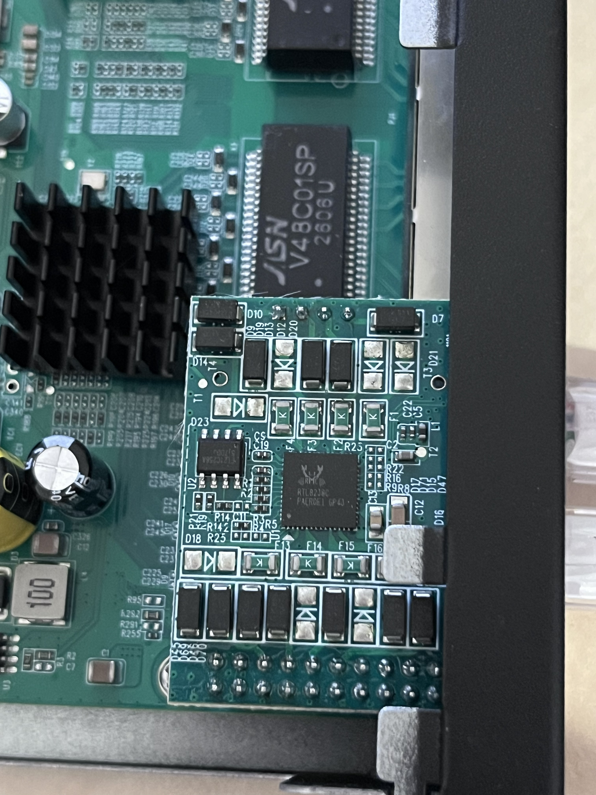

# keepLink KP-9000-9XHPML-X V3.1

An 8 × 2.5G RJ45 managed **PoE+** switch with one SFP+ uplink, built on an RTL8373 SoC with two
RTL8238B PSE controllers. The hardware is the **same board** as the base 
KP-9000-9XHML-X V3.1 — the only difference is the populated, software-
controlled PoE — so it reuses that board's machine descriptor and just adds the PSE.

> **Machine name:** `KP_9000_9XHPML_X_V3_1`. Selecting it reuses the base
> `KP_9000_9XHML_X_V3_1` config and adds the RTL8238B PSE (there is **one** machine block in
> [machine.c](../../machine.c); the PoE bits are conditionally compiled). The base
> `KP_9000_9XHML_X_V3_1` machine stays PoE-less.

### Label specifications

- **Name**: 8 × 2.5G RJ45 PoE+ Port + 1 × 10G SFP+ Port
- **Model**: KP-9000-9XHPML-X-AC
- **Ports**:
  - 8 × RJ45: 10/100/1000/2500 Mbps, 802.3af/at PoE+ (PSE)
  - 1 × SFP+: 1000 / 2500 / 10000 Mbps

### What works

- All eight 2.5GBASE-T RJ45 ports
- SFP+ uplink, LEDs, reset button (as on the base V3.1)
- **PoE**: automatic bring-up at boot, per-port and global enable/disable, and live telemetry
  (power state, class, voltage, current, power, total consumption) — all driven by direct PSE
  register access. See **[../poe-rtl8238b.md](../poe-rtl8238b.md)** for how the mechanism works.

### PoE details

- **PSE:** 2 × RTL8238B-VB on I2C bus 0 (`GPIO46 = SCL0`, `GPIO47 = SDA0`), addresses
  **`0x20`** (ports 1–4) and **`0x21`** (ports 5–8).
- **Firmware image:** the ~8 KB RTL8238B image (an OEM dump can also carry a larger image for a
  *different* PSE chip). Volatile, uploaded at every boot; **not** shipped in
  this repo — extract it from your board's OEM firmware with
  [`tools/poe/extract_rtl8238b_image.py`](../../tools/poe/extract_rtl8238b_image.py) and copy it to
  `tools/poe/pse_image.bin` (see
  [../poe-rtl8238b.md](../poe-rtl8238b.md#obtaining-the-pse-firmware-image)). The firmware reads
  the image length from its own header, so the firmware hardcodes no image size.
- **Descriptor** (in [machine.c](../../machine.c)):
  `.poe = { .chip = POE_RTL8238B, .addr0 = 0x20, .addr1 = 0x21, .n_ports = 8 }`.
- **Verified on hardware:** a Class 4 PD on port 3 read **51 V / 153 mA**; auto-detect powers
  only genuine PDs (an enabled-but-empty port stays off).

### Build

1. **Extract the PSE image** from your OEM firmware — `tools/poe/extract_rtl8238b_image.py` writes
   `tools/poe/pse_image.bin` ready to use (see
   [obtaining the PSE firmware image](../poe-rtl8238b.md#obtaining-the-pse-firmware-image)).
2. **Build** for `MACHINE=KP_9000_9XHPML_X_V3_1` and flash the web-upgrade image as described in
   the [README](../../README.md) (*"Compiling…"* / *"Installation through the Web interface"*),
   then **cold power-cycle**.

### Hardware overview

PCB, top side:

The PSE section — the two RTL8238B PoE controllers:

### Power supply

Mains AC input (internal PSU) sized for the PoE power budget.
