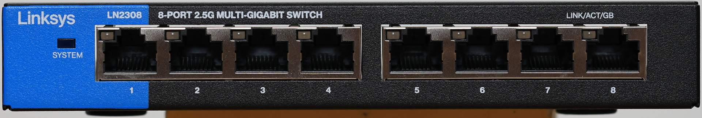
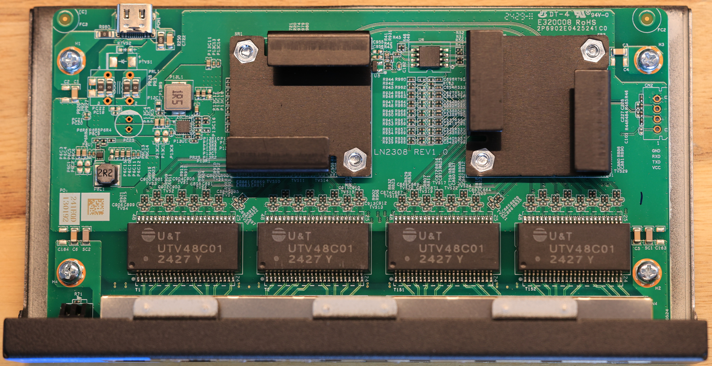
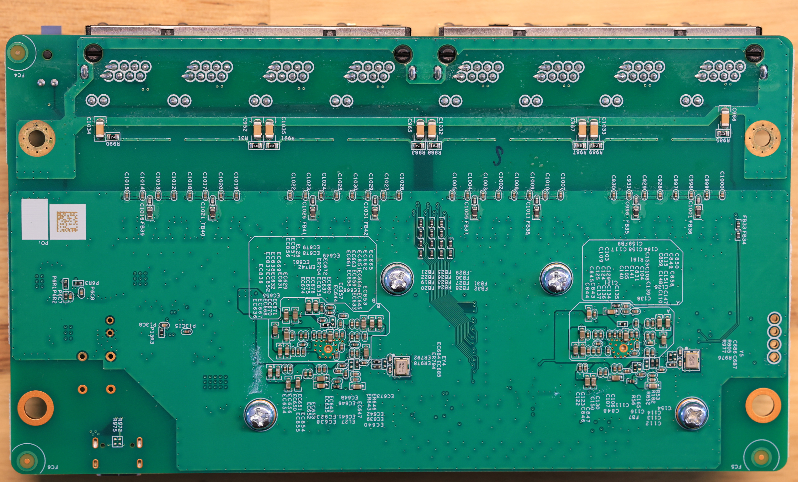
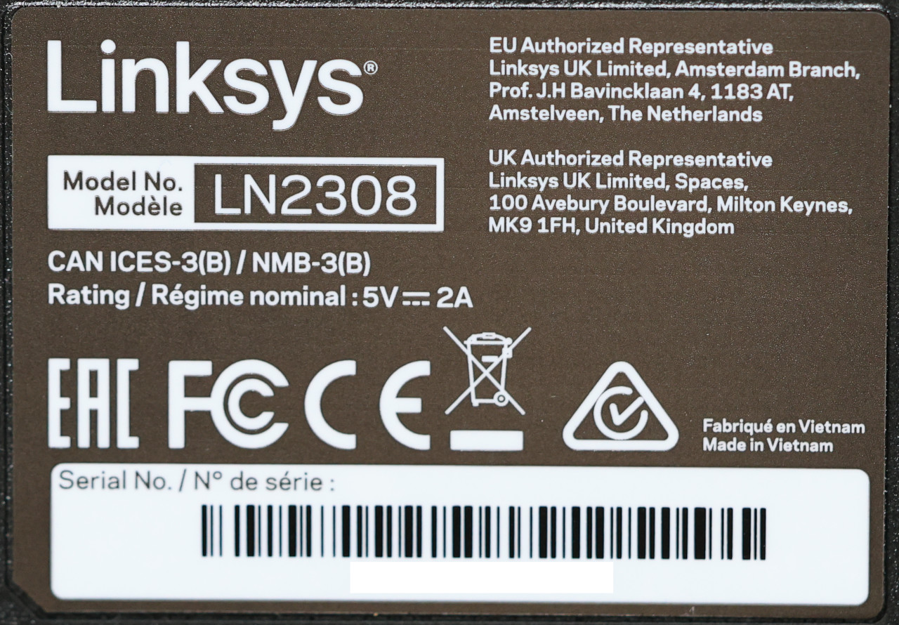

# Linksys LN2308

Unmanaged 8-port 2.5GBit switch, no SFP cage. Machine target `MACHINE_LINKSYS_LN2308`.

**Status:** tested on hardware. RTLPlayground boots and has been exercised on this board: all
eight port labels (case label N is chip port N-1 with no swaps, found by walking a cable along
labels 1-8), 2.5G links on both PHY groups, line-rate forwarding with no error counters, the web
interface, and a firmware update over the web.

The board needs two options that other RTL8373N boards do not: single-IO flash reads
(`FLASH_SIO_ONLY`, because the W25Q80DV returns corrupt data for dual-IO memory-mapped reads) and
the RTL8224 reset on GPIO30 (`rtl8224_reset_pin`, because GPIO36 resets the whole board here).



### Hardware

| Item | Value | How it was established |
|---|---|---|
| Switch SoC | RTL8373N | chip id register `0x0004` = `0x83737000` (Realtek SDK: RTL8373N + RTL8224N) |
| PHY | RTL8224N on SerDes 0 (10G-QXGMII), 4 ports; 4 ports on the internal PHYs | clause-45 PHY id `0x001c:0xcad0`; boot banner patches PHY masks `0xf` and `0xf0` |
| SerDes 1 | configured 10GBASE-R by the stock firmware, no connector | `SDS_MODE_SEL` (`0x7b20`) = `0x0b4d` |
| Flash | Winbond `25Q80DVSIG` (W25Q80DV), 8 MBit / 1 MiB | chip marking |
| Stock console | 9600 baud 8N1, Realtek production test shell, prompt `RTL8371B:` | UART |

### Stock LED configuration (read from the ASIC)

```
LED_GLB_CTRL   0x6520 = 00214428      LED_PORT_SET_SEL 0x654c = 00004500
LED1_0_SET0    0x6548 = 01540141      LED3_2_SET0      0x6544 = 01411000
LED1_0_SET1    0x6540 = 01410174      LED3_2_SET1      0x653c = 18000041
LED1_0_SET2    0x6538 = 01440170      LED3_2_SET2      0x6534 = 01400141
LED1_0_SET3    0x6530 = 02000400      LED3_2_SET3      0x652c = 007f013f
LED3_0_SET1    0x6528 = 00000000      LED3_0_SET3      0x6524 = ff001400
LED_GLB_ACTIVE 0x65d8 = 2cff69ff      LED_GLB_IO_EN    0x65dc = 7324977f
LED_GLB_MUX_1..6 0x65e0.. = 08144040 10349309 12454391 19616555 1c79d65a 0002181d
PIN_MUX_0      0x7f8c = 3cdb6880      GPIO_OE0/OUT0 0x004c/0x003c = 40000000 (GPIO30 driven high)
```

These decode to the same LED mux table and high-LED settings as `FG-8GT-1SX`. Per-port LED
set 0 = LED0 2.5G link/act, LED1 1G/100M link/act. The stock set selection puts chip ports
4, 5 and 7 on set 1 (LED0/LED1 swapped), and that reflects how the LEDs are actually wired:
with set 0 on every port and a 2.5G host linked to each port in turn, case labels 5, 6 and 8
lit the amber LED while all others lit green, so the machine entry keeps
`port_led_set = {0,0,0,0,1,1,0,1,0}`.

### Board specifics

- The board has no reset button.
- GPIO30 (stock: output, high) is the RTL8224 reset (`rtl8224_reset_pin`). The generic GPIO36
  pulse used by other RTL8373N boards resets the whole LN2308 (boot loop after "Detecting CPU");
  stock leaves GPIO36 as an input (PIN_MUX_1 = 0x40000041, GPIO_OE1 = 0).
- The W25Q80DV misbehaves with dual-IO memory-mapped reads: the first fetch from another code bank
  executes garbage and the board reboot-loops. `FLASH_SIO_ONLY` selects single-IO fast read.
- Chip port 8 is SerDes 1 (10GBASE-R in the stock config) with nothing attached. It is still
  declared (`max_port = 8`) because `vlan_setup()` configures the CPU port as `max_port + 1`, so
  the web interface and CLI show it as port 9.
- There is no vendor MAC in flash. The stock image is only the Realtek production-test firmware,
  uses just the first 192 KiB and carries no config area, so `mac_flash_offset` stays unset and a
  locally administered MAC is derived from the chip UUID.

### PCB

**Board markings**

- Top silkscreen: `LN2308 REV1.0`

Top side:



The flash is the SOIC-8 at `U6` at the top edge between the two shields, marked `25Q80DVSIG`.

Bottom side:



Case label:



### Serial console

`CN2` with silkscreen labels for the signals.

- **Settings:** 8N1, 3.3V TTL. The stock firmware runs at 9600 baud.
