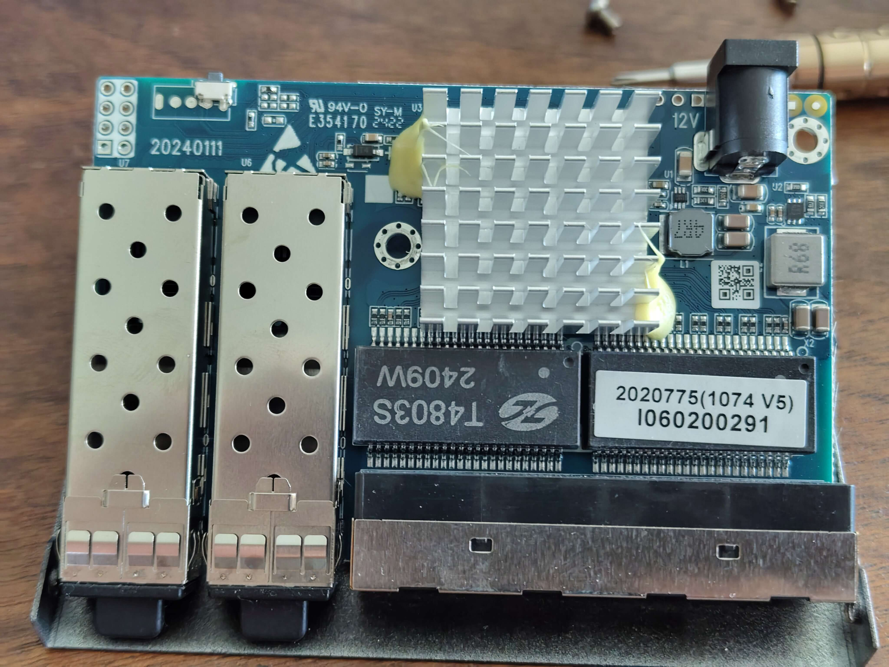

# ONT-S207CW-62TS-SE

## Overview
ONT-S207CW-62TS-SE is a managed switch with **4x 2.5G RJ45 ports** and **2x 10G SFP+ ports**.

**Note:** This device is **identical in hardware** to PCB-SWTG024AS-A-2.0.1. The only difference is the brand label.

## Compatible Devices

The following devices use the **same PCB-SWTG024AS-A-2.0.1 hardware** and are fully compatible with the same firmware configuration:

| Brand | Model | Notes |
|---|---|---|
| ONT | ONT-S207CW-62TS-SE | Original device |
| Binardat | 2G06-04210GSM | Identical hardware, same firmware |
| Mokerlink | KP-9000-6XH-X2 / KP-9000-6XHML-X2 | See [2M-PCB43-V1.1/V2.1](2M-PCB43-V1.1.md) |
| Horaco | ZX-SWTG124AS | See [SWTG024AS-A-V2.0.1_4C_2SFP](SWTG024AS-A-V2.0.1_4C_2SFP.md) |

All these devices can use **MACHINE_PCB_SWTG024AS_A_2_0_1** with the LED configuration from this document.

### Binardat 2G06-04210GSM Photos

**Front View:**


**Back View:**


**PCB View:**


*Note: Photos courtesy of [andreas5232](https://github.com/andreas5232) from [emesix/ONT-S207CW-62TS-SE#1](https://github.com/emesix/ONT-S207CW-62TS-SE/issues/1)*

## Hardware Specification

| Feature | Value |
|---|---|
| **CPU** | RTL8372N (detected via serial: "Detecting CPU: RTL8372N") |
| **Flash** | GD25Q128E (16MB) |
| **RJ45 Ports** | 4x 2.5GBase-T (Ports 1-4) |
| **SFP+ Ports** | 2x 10G (Ports 5-6) |
| **Console** | 115200 baud (RTLPlayground firmware) / 9600 baud (stock firmware) |
| **Web UI IP** | 192.168.2.1 |
| **Loader Mode IP** | 192.168.10.247 |

## Port Layout

```
┌─────────────────────────────────────────────┐
│  ┌─────┐ ┌─────┐ ┌─────┐ ┌─────┐   ┌─────┐ ┌─────┐  │
│  │RJ45 │ │RJ45 │ │RJ45 │ │RJ45 │   │SFP+ │ │SFP+ │  │
│  │  1  │ │  2  │ │  3  │ │  4  │   │  5  │ │  6  │  │
│  └─────┘ └─────┘ └─────┘ └─────┘   └─────┘ └─────┘  │
│                                                     │
│  [System LEDs]                                      │
└─────────────────────────────────────────────┘
```

## LED Behavior (RTLPlayground v10+)

### RJ45 Ports (1-4)
| LED Color | Speed |
|---|---|
| **Green** | 2.5G |
| **Orange** | 1G / 100M / 10M |
| **Off** | No link |

### SFP+ Ports (5-6)
| LED Color | Speed |
|---|---|
| **Green** | 10G |
| **Orange** | 2.5G / 1G |
| **Off** | No link / No SFP module |

## RTLPlayground Configuration

### machine.h
```c
#define MACHINE_PCB_SWTG024AS_A_2_0_1
```

### machine.c (relevant section for PCB_SWTG024AS_A_2_0_1)
```c
__code const struct machine machine = {
    .machine_name = "PCB-SWTG024AS-A-2.0.1",
    .isRTL8373 = 0,                    // RTL8372N
    .mac_flash_offset = 0x1FC000,
    .min_port = 3,
    .max_port = 8,
    .n_sfp = 2,
    .log_to_phys_port = {0, 0, 0, 5, 1, 2, 3, 4, 6},
    .phys_to_log_port = {4, 5, 6, 7, 3, 8, 0, 0, 0},
    .is_sfp = {0, 0, 0, 1, 0, 0, 0, 0, 2},
    
    // SFP port on SDS0 / logical port 3
    .sfp_port[0].pin_detect = GPIO37,
    .sfp_port[0].pin_los = GPIO_NA,
    .sfp_port[0].pin_tx_disable = GPIO_NA,
    .sfp_port[0].sds = 0,
    .sfp_port[0].i2c = { .sda = GPIO41_I2C_SDA3_MDIO1, .scl = GPIO40_I2C_SCL3_MDC1 },
    
    // SFP port on SDS1 / logical port 8
    .sfp_port[1].pin_detect = GPIO38,
    .sfp_port[1].pin_los = GPIO_NA,
    .sfp_port[1].pin_tx_disable = GPIO_NA,
    .sfp_port[1].sds = 1,
    .sfp_port[1].i2c = { .sda = GPIO39_I2C_SDA4, .scl = GPIO40_I2C_SCL3_MDC1 },
    
    .reset_pin = GPIO_NA,
    .high_leds = { .mux = LED_28_SYS | LED_29, .enable = LED_27 | LED_28_SYS | LED_29 },
    .port_led_set = { 0, 0, 0, 1, 0, 0, 0, 0, 1 },
    .led_sets = {
        { // SET0: RJ45 - Green for 2.5G, Orange for 1G/100M/10M
            LEDS_2G5 | LEDS_LINK | LEDS_ACT,
            LEDS_1G | LEDS_100M | LEDS_10M | LEDS_LINK | LEDS_ACT,
            0,
            0
        },
        { // SET1: SFP+ - Green for 10G, Orange for 1G/2.5G
            LEDS_10G | LEDS_LINK | LEDS_ACT,
            LEDS_2G5 | LEDS_1G | LEDS_LINK | LEDS_ACT,
            0,
            0
        },
    },
    .led_mux_custom = 1,
    .led_mux = {
        0x00,0x01,0x04,0x05,0x08,0x09,0x0c,0x3f,0x0d,0x10,0x11,0x0e,
        0x14,0x11,0x12,0x15,0x15,0x16,0x18,0x19,0x1a,0x19,0x1d,0x1e,
        0x1c,0x1d,0x20,0x21
    },
};
```

## Port to Logical Mapping

| Physical Port | Logical Port | Type | LED Set | Web UI Port |
|---|---|---|---|---|
| 1 | 4 | RJ45 | 0 | 1 |
| 2 | 5 | RJ45 | 0 | 2 |
| 3 | 6 | RJ45 | 0 | 3 |
| 4 | 7 | RJ45 | 0 | 4 |
| 5 | 3 | SFP+ | 1 | 5 |
| 6 | 8 | SFP+ | 1 | 6 |

## Firmware History

| Version | Date | Changes | Status |
|---|---|---|---|
| v3 | 2026-09-14 | Original PCB_SWTG024AS_A_2_0_1 config | ✅ All ports working, LEDs wrong |
| v10 | 2026-09-17 | LED colors corrected for RJ45 and SFP+ | ✅ All ports + LEDs working |

## Firmware Files

| File | Purpose |
|---|---|
| `rtlplayground-ONT_S207CW-v10.bin` | Direct flash via CH341A |
| `rtlplayground_oem_upgrade-ONT_S207CW-v10.bin` | OEM upgrade via web UI |

## Flashing Instructions

### Via Loader Mode (CH341A)
```bash
flashrom -p ch341a_spi -c "GD25Q128E" -w rtlplayground-ONT_S207CW-v10.bin
```

### Via Web UI
1. Access the web interface at `http://192.168.2.1`
2. Navigate to **Firmware Update** (under System tab)
3. Upload `rtlplayground_oem_upgrade-ONT_S207CW-v10.bin`
4. Wait for flash completion and automatic reboot

## Recovery

If flashing fails and the switch does not boot:

1. **Loader Mode Recovery:**
   - Hold reset button while powering on
   - Switch should be accessible at `192.168.10.247`
   - Flash via `curl -T firmware.bin http://192.168.10.247/firmware`

2. **Serial Recovery:**
   - Connect via UART (115200 baud for RTLPlayground, 9600 for stock)
   - Use CH341A: `flashrom -p ch341a_spi -c "GD25Q128E" -w firmware.bin`

## Stock Firmware Information

- **Default IP:** 192.168.10.247
- **Default Login:** admin/admin (varies by OEM)
- **Console Baud:** 9600
- **CPU:** RTL8372N

## Known Issues & Fixes

### Issue: LEDs showing wrong colors
**Symptom:** RJ45 ports show green at all speeds, SFP LEDs don't light up
**Fix:** Use v10 firmware with corrected LED sets and LED mux configuration

### Issue: No network connectivity after flash
**Symptom:** Switch boots but no ping response
**Fix:** Ensure `.isRTL8373 = 0` (RTL8372N) is set - this device uses RTL8372N, not RTL8373

## Notes

- This device shares the exact same PCB as PCB-SWTG024AS-A-2.0.1
- The hardware detection string is "PCB-SWTG024AS-A-2.0.1"
- Port numbering in the web UI may appear reversed (4321 instead of 1234) due to the port mapping, but physical ports 1-4 are RJ45 and 5-6 are SFP+
