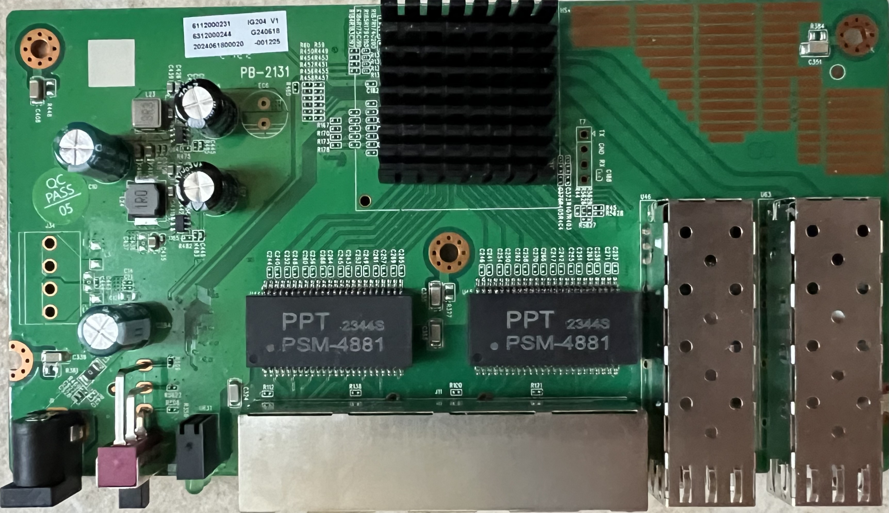
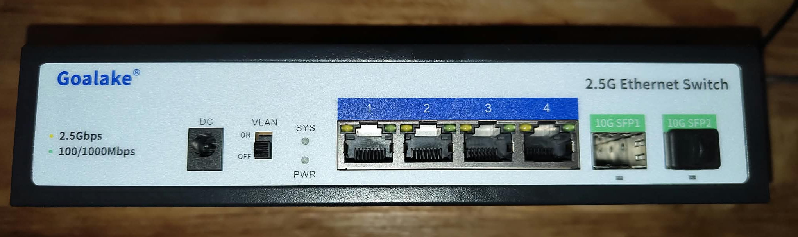
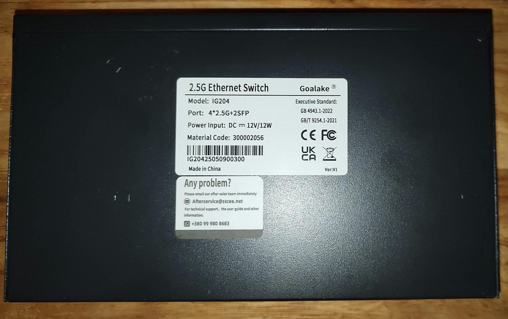

# PB-2131

Following is documentation for unmanaged switch marked as `IG204-V1`.

Original software is running UART on 9600 baud rate, contains a rudimentary CLI.

Initial installation is only possible via a direct write to the SPI flash.

### Brands

| Brand    | Type       | Managed | PCB        | Flash       | Chip RTL      |
|----------|------------|---------|------------|-------------|------------|
| Goalake  | IG204-V1   | No      | PB-2131    | cFeon QE32A | 8372  |
| STEAMEMO | IG204-V1 (no V1 on case)   | No      | PB-2131    | cFeon Q32A  | 8372  |

### Label specifications (STEAMEMO)

- **Name**: 2.5G Ethernet Switch  
- **Model**: IG204 V1
- **Ports**:  
  - 4 × RJ45: 10/100/1000/2500 Mbps  
  - 2 × SFP: 1000 / 2500 / 10000 Mbps  

### What works

- All four 2.5GBASE-T RJ45 ports at 10/100/1000/2500 Mbps  
- Both SFP ports supporting 1G, 2.5G and 10G modules 
- LEDs

### PCB overview

**Board markings**  
- Top silkscreen: PB-2131

Top side PCB

Case front Goalake

Case bottom Goalake

### Connectors
### T7, serial console

| `T7` pin | Signal      |
| -------- | ----------- |
| 1        | TX (Output) |
| 2        | GND         |
| 3        | RX (Input)  |
| 4        | 3V3         |

### Power supply

Input power is delivered via barrel plug, a `12V 1A` adapter is provided.
