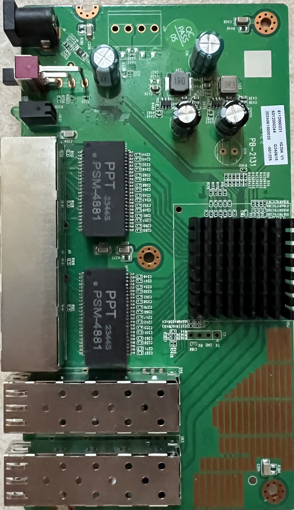

# Steamemo IG204-V1

Following is documentation for unmanaged switch marked as `IG204-V1`.

Using SPI clamp in-board is the only method for initial installation.

### Label specifications

- **Name**: 2.5G Ethernet Switch  
- **Model**: IG204 V1
- **Ports**:  
  - 4 × RJ45: 10/100/1000/2500 Mbps  
  - 2 × SFP: 1000 / 2500 / 10000 Mbps  

### What works (expected from label + similar devices)

- Four 2.5GBASE-T RJ45 ports at 10/100/1000/2500 Mbps  
- Two SFP ports supporting 1G, 2.5G and 10G modules 
- LEDs

### PCB overview

**Board markings**  
- Top silkscreen: PB-2131

Top side

### Connectors
### T7, serial console

| `T7` pin | Signal      |
| -------- | ----------- |
| 1        | TX (Output) |
| 2        | GND         |
| 3        | RX (Input)  |
| 4        | 3V3         |

### Power supply

Input power is delivered via barell plug, `12V 1A` adapter was provided.
