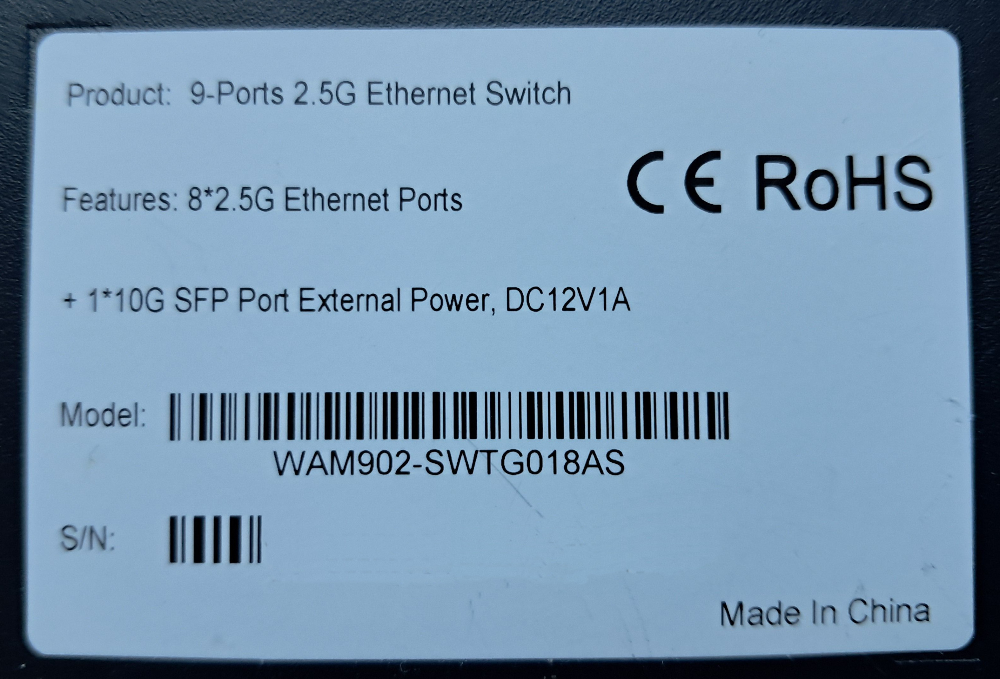
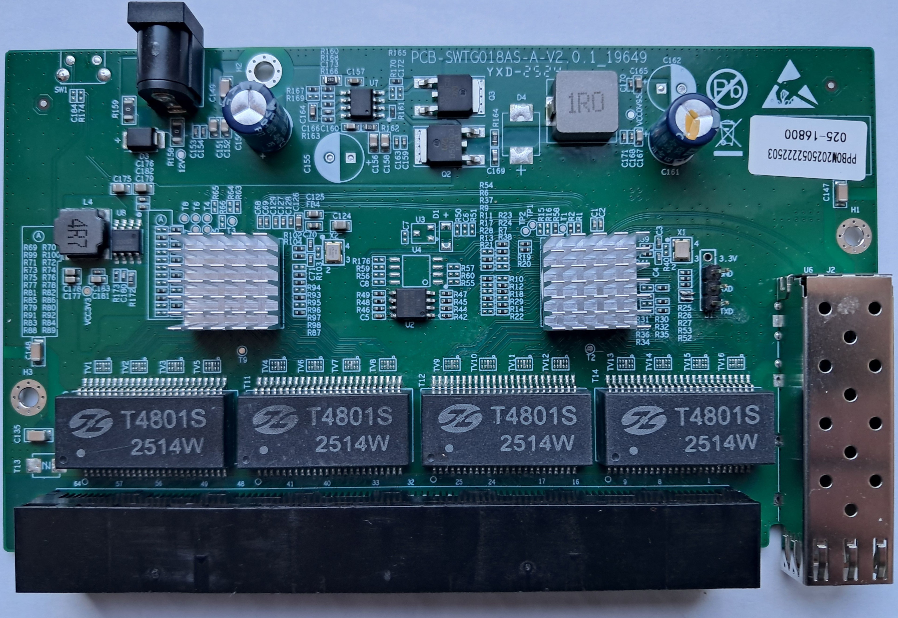
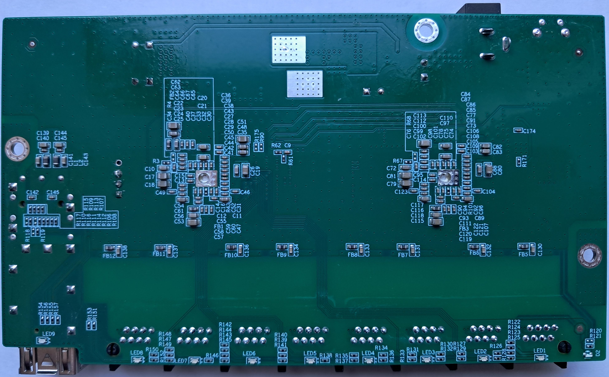

# SWTG018AS-A V2.0

The following is a documentation for the unmanaged switch marked as `SWTG018AS-A V2.0`.
It is e.g. sold under the Ampcom brand, but no branh-markings are found on the device.

The original software is running UART on 9600 baud rate. 

Using a SOIC clamp in-board is the only method for initial installation.

The board has a single flash chips `BS` with 4M-bit size. The front switch, switches between the two flash chips.
These can be programed independently by using said switch - so it is e.g. possible to run the original and new firmware in parallel.

### Label specifications

- **Name**: 9-Ports 2.5G Ethernet Switch
- **Ports**:
  - 8 × RJ45: 10/100/1000/2500 Mbps
  - 1 × SFP+: 1000 / 2500 / 10000 Mbps
- **Power**: 12V DC, 1A barrel connector 

### What works
The device is fully supported:
- All 8 2.5GBASE-T RJ45 ports work at 10/100/1000/2500 Mbps
- The SFP+ port supports 1G, 2.5G and 10G modules 
- LEDs work with the same indiciations as the OEM firmware

### PCB overview

**Board markings**
- Top silkscreen: SWTG018AS-A-V2.0.1_19649

Top side

Bottom

### J1, serial console

| `J1` pin | Signal      |
| -------- | ----------- |
| 1        | 3V3         |
| 2        | GND         |
| 3        | RX (Input) |
| 4        | TX (Output)  |

## Power supply

Input power is delivered via barell plug, `12V 1A` adapter was provided.
