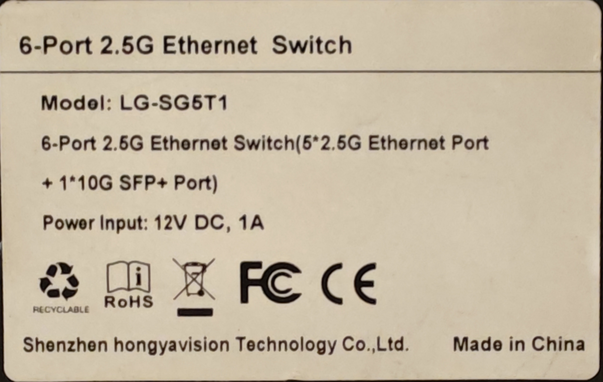

### SWTG024AS-V2.0

## Brands
|Brand|Type|Managed|PCB|Flash|Chip RTL|
|---|---|---|---|---|---|
| hongyavision | LG-SG5T1 | No | PCB-SWTG024AS-V2.0_16895 | 25Q40 | 8272 |

### Label specifications

- **Name**: 
- **Ports**:
  - 5 × RJ45: 10/100/1000/2500 Mbps
  - 1 × SFP+: 1000 / 2500 / 10000 Mbps
- **Power**: 12V DC, 1A  5525 connector 

### What works
The device is fully supported:
- ALL 2.5GBASE-T RJ45 ports work at 10/100/1000/2500 Mbps
- The SFP+ port supports 1G, 2.5G and 10G modules 
- LEDs work with the same indiciations as the OEM firmware
- Online update does not work with 512KiB flash.
### PCB overview

**Board markings**
- Top silkscreen: PCB-SWTG024AS-V2.0

Top side

Bottom

### J1, serial console

| `J1` pin | Signal      |
| -------- | ----------- |
| 1        | GND         |
| 2        | RX (Input)  |
| 3        | TX (Output) |

Note,`R52`、`R53`may not be installed.You need to bridge them using either solder or resistors.

## Power supply

Input power is delivered via barell plug, `12V 1A` adapter was provided.