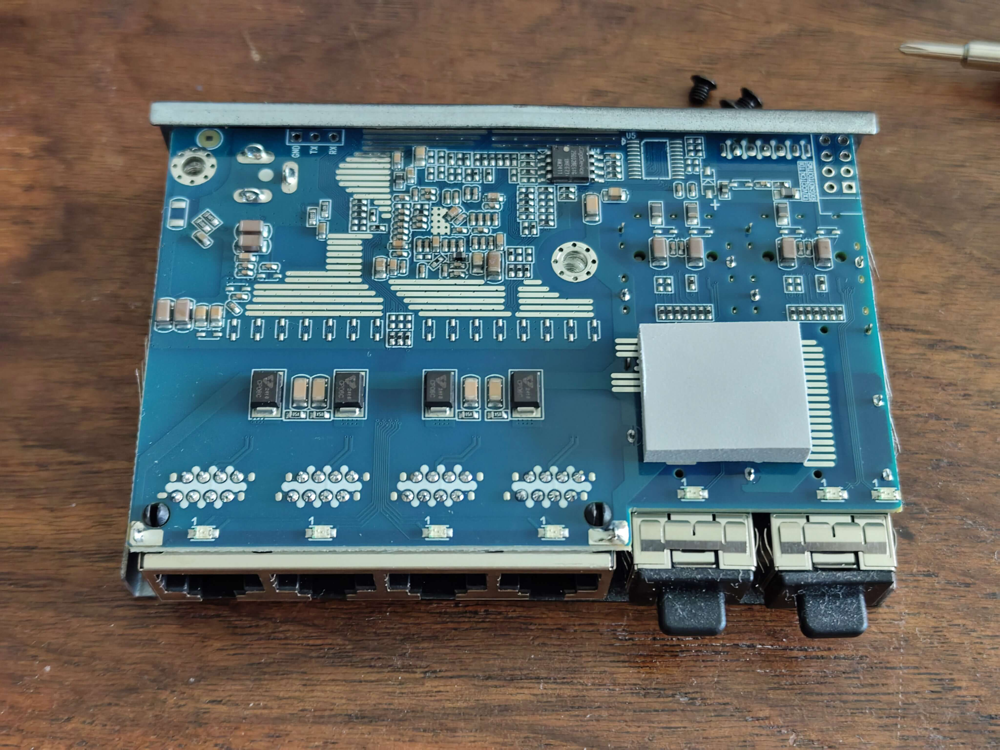
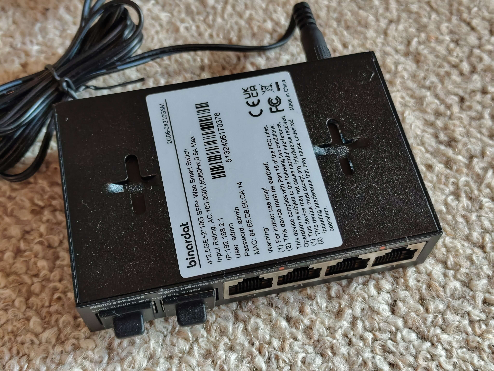

# SWTG024AS

SWTG024AS has at least 4 variants that look the same.

Variants are `managed` and a `unmanaged` version.
But both have pcb version `v1.0` and `v2.0`. 
Also the RJ45 connectors can be all plastic/non-shielded or with metal shielding.

## Brands
|Brand|Type|Managed|PCB|PCB Label|Flash|Chip RTL|
|---|---|---|---|---|---|---|
| Binardat | 2G06-04210GSM | No | PCB-SWTG024AS-A-2.0.1 | --- | 16MB | RTL8372N |
| Horaco | ZX-SWTG124AS | Yes | SWTG024AS-v2.0 | ??? | ??? | 8272 |
| LIANGUO | SWTG024AS | No | SWTG024AS-v2.0-17452 | CM-23-11-2336 023-17453 | 512 KiB | 8272 |
| ONT | ONT-S207CW-62TS-SE | No | PCB-SWTG024AS-A-2.0.1 | --- | 16MB | RTL8372N |
| Sodola | SL-SWTG124AS-D | Yes | SWTG024AS-v2.0-17452 | ??? | 2048 KiB | 8272 |
| Xikestore | SKS3200M-4GPY2XF | Yes | SWTG024AS-v1.0 | CM-23-08-2043 023-16721 | 2048 KiB | 8272 |

## PCB


## PCB-SWTG024AS-A-2.0.1 Variant

**Note:** ONT-S207CW-62TS-SE and Binardat 2G06-04210GSM are **identical in hardware** to this PCB variant. The only difference is the brand label.

### Compatible Devices

The following devices use the **same PCB-SWTG024AS-A-2.0.1 hardware** and are fully compatible with the same firmware configuration:

| Brand | Model | Notes |
|---|---|---|
| ONT | ONT-S207CW-62TS-SE | Original device |
| Binardat | 2G06-04210GSM | Identical hardware, same firmware |

All these devices can use **MACHINE_PCB_SWTG024AS_A_2_0_1** with the LED configuration from this document.

### Photos (Binardat 2G06-04210GSM)

**Front View:**


**Back View:**


**PCB View:**


*Photos courtesy of [andreas5232](https://github.com/andreas5232) from [emesix/ONT-S207CW-62TS-SE#1](https://github.com/emesix/ONT-S207CW-62TS-SE/issues/1)*

### Hardware Specification

| Feature | Value |
|---|---|
| **CPU** | RTL8372N (detected via serial: "Detecting CPU: RTL8372N") |
| **Flash** | GD25Q128E (16MB) |
| **RAM** | Integrated in RTL8372N |
| **RJ45 Ports** | 4x 2.5GBase-T (Ports 1-4) |
| **SFP+ Ports** | 2x 10G (Ports 5-6) |
| **Console** | 115200 baud (RTLPlayground firmware) / 9600 baud (stock firmware) |
| **Web UI IP** | 192.168.2.1 |
| **Loader Mode IP** | 192.168.10.247 |

### Port Layout

```
┌─────────────────────────────────────────────┐
│  ┌─────┐ ┌─────┐ ┌─────┐ ┌─────┐   ┌─────┐ ┌─────┐  │
│  │RJ45 │ │RJ45 │ │RJ45 │ │RJ45 │   │SFP+ │ │SFP+ │  │
│  │  1  │ │  2  │ │  3  │ │  4  │   │  5  │ │  6  │  │
│  └─────┘ └─────┘ └─────┘ └─────┘   └─────┘ └─────┘  │
│                                                     │
│  [System LEDs]                                      │
└─────────────────────────────────────────────┘
```

### Port Mapping

Physical front panel (left to right):
- Ports 1-4: RJ45 2.5GBase-T
- Ports 5-6: SFP+ 10G (Port 5 = left/J4/SFP1, Port 6 = right/J2/SFP2)

RTLPlayground logical mapping:
- Logical port 3 → Physical SFP1 (J4, left)
- Logical port 8 → Physical SFP2 (J2, right)
- Logical ports 4-7 → Physical RJ45 ports 1-4

| Physical Port | Logical Port | Type | LED Set | Web UI Port |
|---|---|---|---|---|
| 1 | 4 | RJ45 | 0 | 1 |
| 2 | 5 | RJ45 | 0 | 2 |
| 3 | 6 | RJ45 | 0 | 3 |
| 4 | 7 | RJ45 | 0 | 4 |
| 5 | 3 | SFP+ | 1 | 5 |
| 6 | 8 | SFP+ | 1 | 6 |

### LED Behavior (RTLPlayground v10+)

#### RJ45 Ports (1-4)
| LED Color | Speed |
|---|---|
| **Green** | 2.5G |
| **Orange** | 1G / 100M / 10M |
| **Off** | No link |

#### SFP+ Ports (5-6)
| LED Color | Speed |
|---|---|
| **Green** | 10G |
| **Orange** | 2.5G / 1G |
| **Off** | No link / No SFP module |

### RTLPlayground Configuration

**machine.h:**
```c
#define MACHINE_PCB_SWTG024AS_A_2_0_1
```

**machine.c configuration:**
```c
__code const struct machine machine = {
    .machine_name = "PCB-SWTG024AS-A-2.0.1",
    .isRTL8373 = 0,                    // RTL8372N
    .mac_flash_offset = 0x1FC000,
    .min_port = 3,
    .max_port = 8,
    .n_sfp = 2,
    .log_to_phys_port = {0, 0, 0, 5, 1, 2, 3, 4, 6},
    .phys_to_log_port = {4, 5, 6, 7, 3, 8, 0, 0, 0},
    .is_sfp = {0, 0, 0, 1, 0, 0, 0, 0, 2},
    
    // SFP port on SDS0 / logical port 3
    .sfp_port[0].pin_detect = GPIO37,
    .sfp_port[0].pin_los = GPIO_NA,
    .sfp_port[0].pin_tx_disable = GPIO_NA,
    .sfp_port[0].sds = 0,
    .sfp_port[0].i2c = { .sda = GPIO41_I2C_SDA3_MDIO1, .scl = GPIO40_I2C_SCL3_MDC1 },
    
    // SFP port on SDS1 / logical port 8
    .sfp_port[1].pin_detect = GPIO38,
    .sfp_port[1].pin_los = GPIO_NA,
    .sfp_port[1].pin_tx_disable = GPIO_NA,
    .sfp_port[1].sds = 1,
    .sfp_port[1].i2c = { .sda = GPIO39_I2C_SDA4, .scl = GPIO40_I2C_SCL3_MDC1 },
    
    .reset_pin = GPIO_NA,
    .high_leds = { .mux = LED_28_SYS | LED_29, .enable = LED_27 | LED_28_SYS | LED_29 },
    .port_led_set = { 0, 0, 0, 1, 0, 0, 0, 0, 1 },
    .led_sets = {
        { // SET0: RJ45 - Green for 2.5G, Orange for 1G/100M/10M
            LEDS_2G5 | LEDS_LINK | LEDS_ACT,
            LEDS_1G | LEDS_100M | LEDS_10M | LEDS_LINK | LEDS_ACT,
            0,
            0
        },
        { // SET1: SFP+ - Green for 10G, Orange for 1G/2.5G
            LEDS_10G | LEDS_LINK | LEDS_ACT,
            LEDS_2G5 | LEDS_1G | LEDS_LINK | LEDS_ACT,
            0,
            0
        },
    },
    .led_mux_custom = 1,
    .led_mux = {
        0x00,0x01,0x04,0x05,0x08,0x09,0x0c,0x3f,0x0d,0x10,0x11,0x0e,
        0x14,0x11,0x12,0x15,0x15,0x16,0x18,0x19,0x1a,0x19,0x1d,0x1e,
        0x1c,0x1d,0x20,0x21
    },
};
```

### Firmware History

| Version | Date | Changes | Status |
|---|---|---|---|
| v3 | 2026-09-14 | Original PCB_SWTG024AS_A_2_0_1 config | All ports working, LEDs wrong |
| v10 | 2026-09-17 | LED colors corrected for RJ45 and SFP+ | All ports + LEDs working |

### Known Issues & Fixes

#### Issue: LEDs showing wrong colors
**Symptom:** RJ45 ports show green at all speeds, SFP LEDs don't light up
**Fix:** Use v10 firmware with corrected LED sets and LED mux configuration

#### Issue: No network connectivity after flash
**Symptom:** Switch boots but no ping response
**Fix:** Ensure `.isRTL8373 = 0` (RTL8372N) is set - this device uses RTL8372N, not RTL8373

### Flashing Instructions

#### Via Loader Mode (CH341A)
```bash
flashrom -p ch341a_spi -c "GD25Q128E" -w rtlplayground-PCB_SWTG024AS_A_2_0_1.bin
```

#### Via Web UI
1. Access the web interface at `http://192.168.2.1`
2. Navigate to **Firmware Update** (under System tab)
3. Upload `rtlplayground_oem_upgrade-PCB_SWTG024AS_A_2_0_1.bin`
4. Wait for flash completion and automatic reboot

### Recovery

If flashing fails and the switch does not boot:

1. **Loader Mode Recovery:**
   - Hold reset button while powering on
   - Switch should be accessible at `192.168.10.247`
   - Flash via `curl -T firmware.bin http://192.168.10.247/firmware`

2. **Serial Recovery:**
   - Connect via UART (115200 baud for RTLPlayground, 9600 for stock)
   - Use CH341A: `flashrom -p ch341a_spi -c "GD25Q128E" -w firmware.bin`

### Stock Firmware Information

- **Default IP:** 192.168.10.247
- **Default Login:** admin/admin (varies by OEM)
- **Console Baud:** 9600
- **CPU:** RTL8372N
- **Hardware detection string:** "PCB-SWTG024AS-A-2.0.1"

**Note:** This variant uses the same PCB as described above but may have different component population.

---

# SWTG024AS-v2.0 managed vs unmanaged

Changes I found with my board vs [Managed version](https://github.com/up-n-atom/SWTG118AS/tree/main/photos/SWGT024AS-v2.0) of the PCB.

### Bottom
* R105: Installed, goes to R10-PullDown SFP2 (J2) -> TX-DISABLE
* R85: Not Installed (Connected to K1 Reset Button)
* R90: Not installed (System Led)
* LED3: Not installed (System Led)
### Top
* K1: Not installed (Reset Button)
* R95: Installed (SFP2 (J2) signal RX-LOS), means that the managed-version can't use the RX-LOS function.
* R270: Installed (SFP1 (J4) signal RX-LOS), same here as above.
* R268: Installed (SFP2 (J2) signal TX-DISABLE, but R262 200R pull-down is to high to drive by the SOC, needs mod!)
* U5: Flash is only 512 KiB instead of 2/4 MiB.

### Notes
* `TX-Disable`-SFP2 and Button `K1` share the same GPIO pin via `R105` and `R85`.
  But via `R88`, `TX-Disable`-SFP2 can be mapped to `GPIO36`.
* `TX-Disable` pull-down resistos on both SFP are to low to drive by the SOC.
  We need to make a `Best`-BOM variant so we can use all the featues.

# Connectors

## Port overview

```
┌────────────────────────────────────────────────────────────────────────────────────────┐
│                                                       ┌──────────┐        ┌──────────┐ │
│     ┌─────────┐ ┌─────────┐ ┌─────────┐ ┌─────────┐   │ SFP (J4) │        │ SFP (J2) │ │
│     │  RJ45   │ │  RJ45   │ │  RJ45   │ │  RJ45   │   │ PORT   5 │        │ PORT   6 │ │
│     │  PORT 1 │ │  PORT 2 │ │  PORT 3 │ │  PORT 4 │   │ MAC    8 │        │ MAC    3 │ │
│  O  │  MAC  4 │ │  MAC  5 │ │  MAC  6 │ │  MAC  7 │   │ SerDes 1 │        │ SerDes 0 │ │
│ RST └─────────┘ └─────────┘ └─────────┘ └─────────┘   └──────────┘        └──────────┘ │
└────────────────────────────────────────────────────────────────────────────────────────┘
``` 

## J4

* Location: Left SFP connector `J4`.
* Connected to: 10GMAC number 8, second SerDes.

|`J4` SFP1 PINs | Signal | Component | GPIO | Notes |
|---|---|---|---|---|
|2| TX_FAULT | B-R262 | --- | |
|3| TX_DISABLE | B-R263, T-R268 | GPIO38 | R262 = Pull-down 200R|
|4| MODDEF2 – SDA | B-R261, T-R266 | GPIO39 | |
|5| MODDEF1 – SCL | B-R260, T-R267 | GPIO40 | Shared with both SFP |
|6| MODDEF0 – PRESENT | B-R259, T-R296 | GPIO30 | |
|7| RATE SEL | B-R257 | --- | |
|8| LOS | B-R258, T-R270 | GPIO37 | |
|9| TO? | B-R256 | --- | |

## J2

* Location: Right SFP connector `J2`.
* Connected to: 10GMAC number 3, first SerDes.

|`J2` SFP2 PINs | Signal | Component | GPIO | Notes |
|---|---|---|---|---|
|2| TX_FAULT | B-R70 | --- | |
|3| TX_DISABLE | B-R10, B-R105-R, T-R88-L | GPIO54 | R10 = Pull-down 200R |
|4| MODDEF2 – SDA | B-R26, T-R85 | GPIO41 | |
|5| MODDEF1 – SCL | B-R15, T-R87 | GPIO40 | Shared with both SFP |
|6| MODDEF0 – PRESENT | B-R14, T-R89 | GPIO50 | |
|7| RATE SEL | B-R12 | --- | |
|8| LOS | B-R13, T-R95 | GPIO51 | |
|9| TO? | B-R11 | --- | |

Note: component numbering `<L>-<REFDES>-<SIDE>`
* L: Layer, T=Top, B=Bottom
* REFDEES: full silkscreen like `R123`
* SIDE: Side of the component. when the rj45 are facing towards you are you can read the silkscreen normal.
  L = Left, R=right, B=bottom, T=top or P with a pin number.

### T3, Slave Interface
This connector goes to U4 `I2C EEPROM` and U10 `SPI FLASH`.
Signals are based on that `U4` is likely a I2C-EEPROM, `U10` is likely other SPI-chip.
|`T3` pin|what|Signal|
|---|---|---|
|1| U4-P6, 33R U10-P6 | I2C-SCL, SPI-CLK, Slave SCK/SCL/MDC/EE_SCL |
|2| GND | --- |
|3| U4-P5, U10-P5 | I2C-SDA, SPI-DI/DO, Slave SDI/SDA/MDIO/EE_SDA |
|4| VCC |
|5| 33R -> U10-P2 | SPI-DO/D1 | 
|6| U10-P1 | SPI-CS |
Note: 1 pin is square shaped.

The Slave Interface allows an extenal host to controll the SOC even if the internal MCU is used.
Depending on the `IF_SEL` bootstrap resistors, this can me `I2C`, `SPI` or `SMI`.
On this device it is `I2C` on address `0b1011100` or `0x5c` (7-bit notation).

* I2c Read: must be a write_read opperation `<Dev-ADDR><RegAddr15:8><RegAddr7:0>` `<DevAddr><Data7:0><Data15:8><Data23:16><Data31:24>`.
* I2c Write: `<Dev-ADDR><RegAddr15:8><RegAddr7:0><DevAddr><Data7:0><Data15:8><Data23:16><Data31:24>`.

Example register `0x0004` return chip id `0x00, 0x00, 0x72, 0x83` = `0x83720000`.

### T5, serial console
|`T5` pin|GPIO|Signal|
|---|---|---|
| 1 | GPIO31 | U0TXD (Output) |
| 2 | GND | |
| 3 | GPIO32 | U0RXD (Input) |
| 4 | 3V3 | |
Note: 1 pin is square shaped.

### T8
|`T8` pin|what|Signal|
|---|---|---|
| 1 | GPIO46 | |
| 2 | GND | |
| 3 | GPIO48 | |
| 4 | 3V3 | |
| 5 | GPIO47 | |
| 6 | GPIO49 | |
Note: 1 pin is square shaped.

# Reset ciruit
| Cmp | Function |
|---|---|
| T-R78 | 33k PullUp |
| T-D3 | Discharge Diode |
| T-C187 | RC-Delay |

Reset-line found at `T-D3-D` active-low.

# GPIO
| HEX VAL. | GPIO | Component | What | | GPIO | Component | What |
| -------- | ------ | ---- | ---- | ---- | ---- | ---- | ---- |
| 00000001 | GPIO00 | T-C151-T, T-R28-T, T-R29-T |? | | GPIO32 | T-R143-R | U0RXD |
| 00000002 | GPIO01 | T-C152-T |? | | GPIO33 | | |
| 00000004 | GPIO02 | T-C153-T |? | | GPIO34 | | |
| 00000008 | GPIO03 | T-R33-T |? | | GPIO35 | | |
| 00000010 | GPIO04 | B-C155 |? | | GPIO36 | T-R88-L, T-R84-B | Optional SFP2 TX-DISABLE[^2], Reset |
| 00000020 | GPIO05 | B-C156 |? | | GPIO37 | SFP1-8, T-R270 | SFP-LOS |
| 00000040 | GPIO06 | T-C157-T |? | | GPIO38 | SFP1-3, T-R268 | SFP1 TX-DISABLE[^2] |
| 00000080 | GPIO07 | T-C158-T, R165 |? | | GPIO39 | SFP1-4, T-R266 | I2C-SDA4 |
| 00000100 | GPIO08 | | | | GPIO40 | SFP2-5, T-R87; SFP1-5, T-R267; | I2C-SCL |
| 00000200 | GPIO09 | SFP2-LED, T-R36-T |LED-SFP2 | | GPIO41 | SFP2-4, T-R85 | I2C-SDA |
| 00000400 | GPIO10 | | | | GPIO42 | U8-P6, T-R124 | SPI-MEMORY, CLK |
| 00000800 | GPIO11 | |LEDx[^1] | | GPIO43 | U8-P5, T-R127 | SPI-MEMORY, DI,IO0 |
| 00001000 | GPIO12 | |LEDx[^1] | | GPIO44 | U8-P2, T-R128 | SPI-MEMORY, DO,IO1 |
| 00002000 | GPIO13 | PORT1-LED-GREEN |LEDx[^1] | | GPIO45 | U8-P1, T-R123 | SPI-MEMORY, CS |
| 00004000 | GPIO14 | PORT1-LED-YELLOW |LEDx | | GPIO46 | T8-1, T-R188| ? |
| 00008000 | GPIO15 | |LEDx[^1] | | GPIO47 | T8-5, T-R190 | ? |
| 00010000 | GPIO16 | PORT2-LED-GREEN |LEDx[^1] | | GPIO48 | T8-3, T-R189 | ? |
| 00020000 | GPIO17 | PORT2-LED-YELLOW |LEDx | | GPIO49 | T8-6, T-R190 | ? |
| 00040000 | GPIO18 | |LEDx[^1] | | GPIO50 | SFP2-6, T-R89 | SFP-DETECT |
| 00080000 | GPIO19 | PORT3-LED-GREEN |LEDx[^1] | | GPIO51 | SFP2-8, T-R95 | SFP-LOS |
| 00100000 | GPIO20 | PORT3-LED-YELLOW |LEDx | | GPIO52 | | |
| 00200000 | GPIO21 | |LEDx[^1] | | GPIO53 | | |
| 00400000 | GPIO22 | PORT4-LED-GREEN |LEDx[^1] | | GPIO54 | SFP2-3, T-R105-L | SFP2 TX-DISABLE[^2] or via T-R85 to RESET[^3], T-R84-T |
| 00800000 | GPIO23 | PORT4-LED-YELLOW |LEDx | | GPIO55 | T-R78-B | |
| 01000000 | GPIO24 | SFP1-LED-J4, T-R35 |LED-SFP1 | | GPIO56 | | |
| 02000000 | GPIO25 | | | | GPIO57 | | |
| 04000000 | GPIO26 | ? |LEDx | | GPIO58 | | |
| 08000000 | GPIO27 | R44L |? | | GPIO59 | | |
| 10000000 | GPIO28 | LED-SYSTEM, T-R50-R |LED-SYSTEM | | GPIO60 | | |
| 20000000 | GPIO29 | T-R187-R | | | GPIO61 | | |
| 40000000 | GPIO30 | SFP1-6, T-R269 |SFP-DETECT | | GPIO62 | | |
| 80000000 | GPIO31 | T-R144-R |U0TXD| | GPIO63 | | |

# LEDs

| NAME | COMPONENTS | GPIO | Active |
| ---- | ---------- | ---- | ------ |
| SYSTEM | T-R50-R (PU-4k2), T-R49-L, T-C185-L, B-R90 | GPIO28 | Low |
| SFP1 | T-R35-L (PU-3k9), T-R34-L, T-C179-L | GPIO24 | Low |
| SFP2 | T-R36-T (PD-4k0) | GPIO09 | High |
| PORT1-LED-YELLOW | | GPIO14 | Low |
| PORT2-LED-YELLOW | | GPIO17 | Low |
| PORT3-LED-YELLOW | | GPIO20 | Low |
| PORT4-LED-YELLOW | | GPIO23 | Low |

# Power supply

Board has two supply rails.
`0.95` and `3.3` volt.

## `0.95` Core Voltage.

Voltage is made by a `Richtek RT8120A` Buck converter.
0.95V must be within 3%.

## `3.3` Voltage

Voltage is crated by a `TMI3244T` Buck converter.
3.3V must be within 4.5%.
Chip can deliver up to 4A and the sweetspot is at 1A.
So higher power SFP-modules should work.


[^1]: LEDs are found by just plugin a RJ45 connector and see with cmd `gpio` the status change. But the bit pattern for port 1,2 are diffrent from port 3,4.
[^2]: Only on the unmanaged verions are `R10` and `R268` placed. But the very low pull-down resistor `R10` and `R262` prevent to SOC to drive does pins. A mod is needed.
[^3]: GPIO54 is used for the reset-button. `T-R85` is placed.
