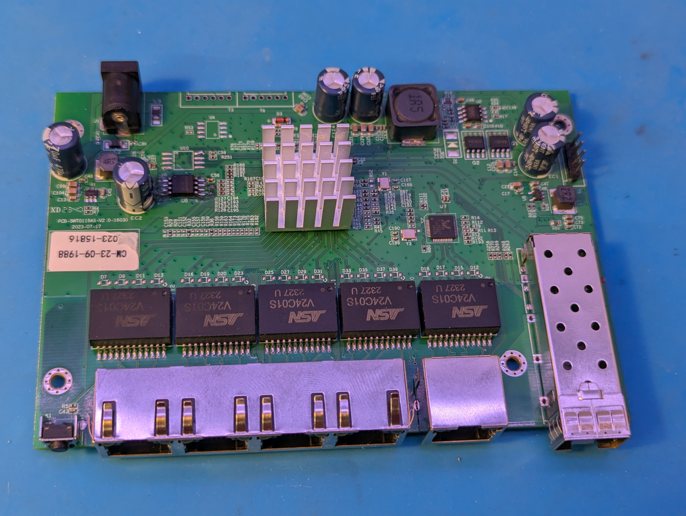

### ZX-SWTGW215AS

## Brands
|Brand|Type|Managed|PCB|Flash|Chip RTL|
|---|---|---|---|---|---|
| Lianguo | ZX-SWTGW215AS | Yes | PCB-SWTG115AS-V2.0 | FM25Q16A | 8272 |

## RTLPlayground target

Use machine target `MACHINE_LIANGUO_ZX_SWTGW215AS` for this device.

Physical hardware verification: 5x RJ45 ports + 1x SFP port. 
Port 5 RJ45 is interfaced through a RTL8221B IC.

## PCB



# Connectors

## Port overview

```
┌──────────────────────────────────────────────────────────────────────────────────┐
│                                                                   ┌──────────┐   │
│     ┌─────────┐ ┌─────────┐ ┌─────────┐ ┌─────────┐ ┌─────────┐   │ SFP (J4) │   │
│     │  RJ45   │ │  RJ45   │ │  RJ45   │ │  RJ45   │ │  RJ45   │   │  PORT 6  │   │
│     │  PORT 1 │ │  PORT 2 │ │  PORT 3 │ │  PORT 4 │ │  PORT 5 │   │  LOG  8  │   │
│  O  │  LOG  4 │ │  LOG  5 │ │  LOG  6 │ │  LOG  7 │ │  LOG  3 │   │ SerDes 1 │   │
│ RST └─────────┘ └─────────┘ └─────────┘ └─────────┘ └─────────┘   └──────────┘   │
└──────────────────────────────────────────────────────────────────────────────────┘
```

| Type | RTLPlayground logical ports | Physical index | 
|---|---|---|
| RJ45 | 3, 4, 5, 6, 7 | 1-5 | 
| SFP | 8 | 6 |

## J4

* Location: SFP connector `J4`.
* Connected to: 10GMAC number 8, SerDes 1.

|`J4` SFP PINs | Signal | GPIO | Notes |
|---|---|---|---|
|3|	TX_DISABLE	      | GPIO_NA | Not connected |
|4|	MODDEF2 – SDA     | GPIO39 | I2C SDA (shared with U4) |
|5|	MODDEF1 – SCL     | GPIO40	| I2C SCL (shared with both SFP/U4) |
|6|	MODDEF0 – PRESENT | GPIO30 | Detect |
|8|	LOS	              | GPIO37 | RX Loss of Signal |
### Notes
* Not all signals were mapped mechanically, hence they've been left out of documentation.

## T3, Slave Interface

This connector goes to U4 `I2C EEPROM` and U10 `SPI FLASH` (mappings identical to SWTG024AS).

For detailed Slave Interface functionality and protocol information, see [T3 documentation in SWTG024AS.md](SWTG024AS.md#t3-slave-interface).

|`T3` pin|what|Signal|
|---|---|---|
|1| U4-P6, 33R U10-P6 | I2C-SCL, SPI-CLK, Slave SCK/SCL/MDC/EE_SCL |
|2| GND | --- |
|3| U4-P5, U10-P5 | I2C-SDA, SPI-DI/DO, Slave SDI/SDA/MDIO/EE_SDA |
|4| VCC |
|5| 33R -> U10-P2 | SPI-DO/D1 | 
|6| U10-P1 | SPI-CS |
### Notes
* 1 pin is square shaped.


## T5, Serial Console

|`T5` pin|GPIO|Signal|
|---|---|---|
| 1 | GPIO31 | U0TXD (Output) |
| 2 | GND | |
| 3 | GPIO32 | U0RXD (Input) |
| 4 | 3V3 | |
### Notes
* 1 pin is square shaped.

## T8

|`T8` pin|GPIO|Signal|
|---|---|---|
| 1 | GPIO46 | |
| 2 | GND    | |
| 3 | GPIO48 | |
| 4 | 3V3    | |
| 5 | GPIO47 | |
| 6 | GPIO49 | |

### Notes
* 1 pin is square shaped.
* Mapping unverified but assumed the same as [SWTG024AS.md]

# Reset Circuit
| Function | GPIO |
|---|---|
| Reset button | GPIO54 |
### Notes
* Circuit is active-low

# GPIO

| HEX VAL. | GPIO   | Component / Purpose | Notes |  | GPIO | Component / Purpose | Notes |
| -------- | ------ |  ---- | ---- | ---- | ---- | ---- | ---- |
| 00000001 | GPIO00 | | |  | GPIO32 | T5-3 | U0RXD |
| 00000002 | GPIO01 | | |  | GPIO33 |   |  |
| 00000004 | GPIO02 | | |  | GPIO34 |   |  |
| 00000008 | GPIO03 | | |  | GPIO35 |   |  |
| 00000010 | GPIO04 | | |  | GPIO36 |   |  |
| 00000020 | GPIO05 | | |  | GPIO37 | J4-8 | SFP LOS |
| 00000040 | GPIO06 | | |  | GPIO38 |   |  |
| 00000080 | GPIO07 | | |  | GPIO39 | J4-4, T3 | I2C-SDA (U4/SFP) |
| 00000100 | GPIO08 | | |  | GPIO40 | J4-5, T3 | I2C-SCL (U4/SFP) |
| 00000200 | GPIO09 | | |  | GPIO41 |   |  |
| 00000400 | GPIO10 | | |  | GPIO42 | U10-P6, T3 | SPI FLASH CLK |
| 00000800 | GPIO11 | | |  | GPIO43 | U10-P5, T3 | SPI FLASH DI/IO0 |
| 00001000 | GPIO12 | | |  | GPIO44 | U10-P2, T3 | SPI FLASH DO/IO1 |
| 00002000 | GPIO13 | PORT1 LED GREEN |  |  | GPIO45 | U10-P1, T3 | SPI FLASH CS  |
| 00004000 | GPIO14 | PORT1 LED ORANGE |  |  | GPIO46 | T8-1 |  |
| 00008000 | GPIO15 | | |  | GPIO47 | T8-5 |  |
| 00010000 | GPIO16 | PORT2 LED GREEN |  |  | GPIO48 | T8-3 |  |
| 00020000 | GPIO17 | PORT2 LED ORANGE |  |  | GPIO49 | T8-6 |  |
| 00040000 | GPIO18 | PORT3 LED GREEN |  |  | GPIO50 |   |  |
| 00080000 | GPIO19 | PORT3 LED ORANGE |  |  | GPIO51 |   |  |
| 00100000 | GPIO20 | PORT4 LED GREEN |  |  | GPIO52 |   |  |
| 00200000 | GPIO21 | PORT4 LED ORANGE |  |  | GPIO53 |   |  |
| 00400000 | GPIO22 | PORT5 LED GREEN |  |  | GPIO54 | Reset Button | GPIO54_ACL_BIT2_EN |
| 00800000 | GPIO23 | PORT5 LED ORANGE |  |  | GPIO55 |   |  |
| 01000000 | GPIO24 | SFP LED GREEN | J4 |  | GPIO56 |   |  |
| 02000000 | GPIO25 | | |  | GPIO57 |   |  |
| 04000000 | GPIO26 | | |  | GPIO58 |   |  |
| 08000000 | GPIO27 | | |  | GPIO59 |   |  |
| 10000000 | GPIO28 | LED-SYSTEM |  |  | GPIO60 |   |  |
| 20000000 | GPIO29 | | |  | GPIO61 |   |  |
| 40000000 | GPIO30 | J4-6 | SFP DETECT |  | GPIO62 |   |  |
| 80000000 | GPIO31 | T5-1 | U0TXD |  | GPIO63 |   |  |

# LEDs

| NAME | GPIO | Port(s) | Function | Notes |
| ---- | ---- | ---- | ---- | ---- |
| PORT1 LED GREEN | GPIO13 |5| Activity | LEDS_2G5, LEDS_LINK, LEDS_ACT |
| PORT1 LED ORANGE | GPIO14 | 5 | Speed | LEDS_1G, LEDS_100M, LEDS_10M, LEDS_LINK, LEDS_ACT |
| PORT2 LED GREEN | GPIO16 | 4 | Activity | LEDS_2G5, LEDS_LINK, LEDS_ACT |
| PORT2 LED ORANGE | GPIO17 | 4 | Speed | LEDS_1G, LEDS_100M, LEDS_10M, LEDS_LINK, LEDS_ACT |
| PORT3 LED GREEN | GPIO18 | 3 | Activity | LEDS_2G5, LEDS_LINK, LEDS_ACT |
| PORT3 LED ORANGE | GPIO19 | 3 | Speed | LEDS_1G, LEDS_100M, LEDS_10M, LEDS_LINK, LEDS_ACT |
| PORT4 LED GREEN | GPIO20 | 2 | Activity | LEDS_2G5, LEDS_LINK, LEDS_ACT |
| PORT4 LED ORANGE | GPIO21 | 2 | Speed | LEDS_1G, LEDS_100M, LEDS_10M, LEDS_LINK, LEDS_ACT |
| PORT5 LED GREEN | GPIO22 | 1 | Activity | LEDS_2G5, LEDS_LINK, LEDS_ACT |
| PORT5 LED ORANGE | GPIO23 | 1 | Speed | LEDS_1G, LEDS_100M, LEDS_10M, LEDS_LINK, LEDS_ACT |
| SFP LED GREEN | GPIO24 | 6 (SFP J4) | Multi-speed | LEDS_10G, LEDS_5G, LEDS_2G5, LEDS_1G, LEDS_100M, LEDS_LINK, LEDS_ACT |
| LED-SYSTEM | GPIO28 | --- | System status | --- |

## Notes

While [SWTG024AS.md](SWTG024AS.md) can be used as a general reference for hardware concepts and interface specifications, this device should not be assumed to be identical beside the difference implicitely highlighted below. Not all information has been validated for compatibility with the SWTG215AS. Consult the SWTG024AS documentation with caution and verify any critical details against this device's.

