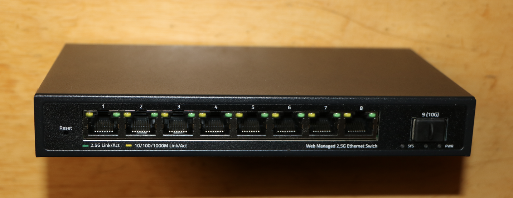
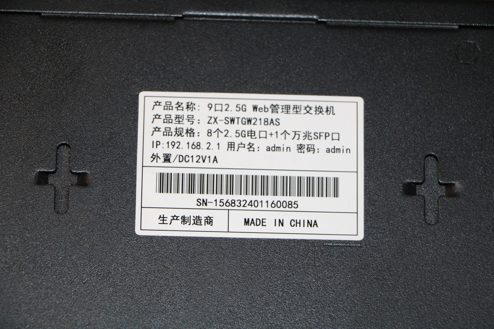

### ZX-SWTGW218AS

## Brands
|Brand|Type|Managed|PCB|Flash|Chip RTL|
|---|---|---|---|---|---|
| Mokerlink | ZX-SWTGW218AS | Yes|  SWTG118AS-V2.0-16029 | 2MB (FM25Q16A)| 8273N + 8224N |
| Sodola | | | | | |
| Horaco | | | | | |

## Photos

## PCB

See up'n'atom's Repo:

https://github.com/up-n-atom/SWTG118AS/blob/main/photos/SWTG118AS-v2.0/SWTG118AS-v2.0-pcb-top.JPG

https://github.com/up-n-atom/SWTG118AS/blob/main/photos/SWTG118AS-v2.0/SWTG118AS-v2.0-pcb-bottom.JPG

