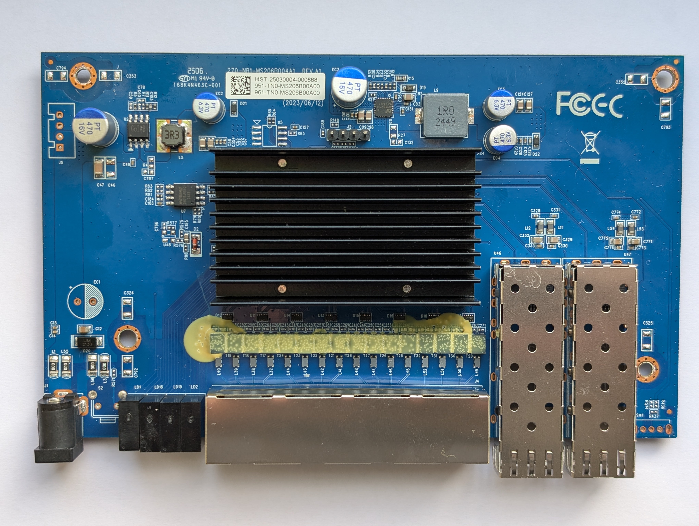
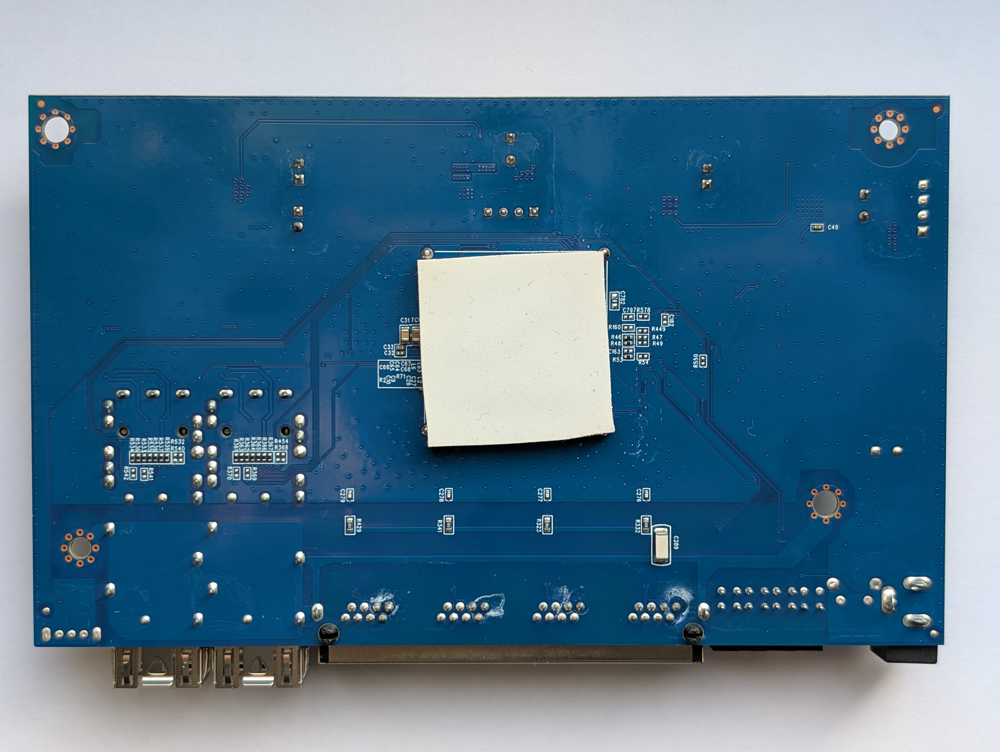

# TrendNet TEG-S562

Following is documentation for unmanaged switch marked as `TEG-S563/EU H/W: V1.0R`.

Original software is running UART on 57600 baud rate. The software does not allow to
do anything fancy via serial. There is `IP` configuration which can be printed as well.
There might be also some flash upload procedure, but using SPI clamp in-board seems to
be easier method.

The memory chip is `Winbond W25Q16JV` with 16M-bit size.

## What does work

1. 2.5G ports on all advertised speeds.
2. SFP+ communication.
3. Serial, Web UI.

## Known issues

1. LEDs are not initialized properly.

## PCB

Manufacturer information be found [on the product page](https://www.trendnet.com/support/support-detail.asp?prod=105_TEG-S562).

Top side



Bottom



## Connectors

### Port overview

```
┌─────────────────────────────────────────────────────────────────────────────┐
│                                                   ┌──────────┐ ┌──────────┐ │
│ ┌─────────┐ ┌─────────┐ ┌─────────┐ ┌─────────┐   │ SFP      │ │ SFP      │ │
│ │  RJ45   │ │  RJ45   │ │  RJ45   │ │  RJ45   │   │ PORT   5 │ │ PORT   6 │ │
│ │  PORT 1 │ │  PORT 2 │ │  PORT 3 │ │  PORT 4 │   │ MAC    ? │ │ MAC    ? │ │
│ │  MAC  4 │ │  MAC  5 │ │  MAC  6 │ │  MAC  7 │   │ SerDes ? │ │ SerDes ? │ │
│ └─────────┘ └─────────┘ └─────────┘ └─────────┘   └──────────┘ └──────────┘ │
└─────────────────────────────────────────────────────────────────────────────┘
```

### J2, serial console

| `J2` pin | Signal      |
| -------- | ----------- |
| 1        | 3V3         |
| 2        | TX (Output) |
| 3        | RX (Input)  |
| 4        | GND         |

Note: 1 pin is square shaped, towards the power input.

### J5, power pass-thru

| `J5` pin | Signal |
| -------- | ------ |
| 1        | 12V    |
| 2        | 12V    |
| 3        | GND    |
| 4        | GND    |

Note: 1 pin is square shaped.

### U5, I2C eeprom placeholder

| `J5` pin | Signal        |
| -------- | ------------- |
| 1        | GND           |
| 2        | GND           |
| 3        | GND           |
| 4        | GND           |
| 5        | 3V3           |
| 6        | ??? Logic Low |
| 7        | SCL           |
| 8        | SDA           |

SOC I2C address is 0x5c.

### SW1 GPIO switch?

Not populated but looks like a switch for selecting
GPIO level. Missing resistors in place.

GPIO mapping unknown.

### S2 Reset ciruit

Not populated but looks like a button can be added on `S2` connector,
requires additional `R571` resistor which will pull signal to ground.

GPIO mapping unknown.

### GPIO

| HEX VAL. | GPIO   | When            | GPIO   | When                   |
| -------- | ------ | ----------------| ------ | -----------------------|
| 00000001 | GPIO00 |                 | GPIO32 |                        |
| 00000002 | GPIO01 |                 | GPIO33 |                        |
| 00000004 | GPIO02 |                 | GPIO34 | Random changes         |
| 00000008 | GPIO03 |                 | GPIO35 |                        |
| 00000010 | GPIO04 |                 | GPIO36 | SFP1 Present           |
| 00000020 | GPIO05 |                 | GPIO37 | SFP1 RX Los            |
| 00000040 | GPIO06 |                 | GPIO38 | SFP2 Present           |
| 00000080 | GPIO07 |                 | GPIO39 |                        |
| 00000100 | GPIO08 |                 | GPIO40 |                        |
| 00000200 | GPIO09 |                 | GPIO41 |                        |
| 00000400 | GPIO10 |                 | GPIO42 | Random changes         |
| 00000800 | GPIO11 |                 | GPIO43 |                        |
| 00001000 | GPIO12 | PORT1 Link      | GPIO44 |                        |
| 00002000 | GPIO13 | PORT1-LED-GREEN | GPIO45 |                        |
| 00004000 | GPIO14 | PORT1-LED-AMBER | GPIO46 | SFP1 I2C CLK           |
| 00008000 | GPIO15 | PORT2 Link      | GPIO47 | SFP1 I2C SDA           |
| 00010000 | GPIO16 | PORT2-LED-GREEN | GPIO48 | SFP2 I2C CLK           |
| 00020000 | GPIO17 | PORT2-LED-AMBER | GPIO49 | SFP2 I2C SDA           |
| 00040000 | GPIO18 | PORT3 Link      | GPIO50 | SFP2 Rx LOS            |
| 00080000 | GPIO19 | PORT3-LED-GREEN | GPIO51 | SFP1 TX Disable        |
| 00100000 | GPIO20 | PORT4-LED-AMBER | GPIO52 |                        |
| 00200000 | GPIO21 | PORT4 Link      | GPIO53 |                        |
| 00400000 | GPIO22 | PORT4-LED-GREEN | GPIO54 | SFP2 TX Disable        |
| 00800000 | GPIO23 | PORT4-LED-AMBER | GPIO55 |                        |
| 01000000 | GPIO24 |                 | GPIO56 |                        |
| 02000000 | GPIO25 |                 | GPIO57 |                        |
| 04000000 | GPIO26 |                 | GPIO58 |                        |
| 08000000 | GPIO27 |                 | GPIO59 |                        |
| 10000000 | GPIO28 |                 | GPIO60 |                        |
| 20000000 | GPIO29 |                 | GPIO61 |                        |
| 40000000 | GPIO30 |                 | GPIO62 |                        |
| 80000000 | GPIO31 |                 | GPIO63 |                        |

## LEDs

Leds are not yet working as in stock firmware. This will be handled later.

Ports 1-4 are amber for 100M/1G links, Green for 2.5G.
Port 5-6 are green for 10G/1G link. Both should flash on activity.

| NAME             | When active    |
| ---------------- | ---------------|
| PWR              | 3V3            |
| SFP1             |                |
| SFP2             |                |
| PORT1-LED-GREEN  | -              |
| PORT2-LED-GREEN  | PORT2 2.5G     |
| PORT3-LED-GREEN  | PORT3 2.5G     |
| PORT4-LED-GREEN  | PORT4 2.5G     |
| PORT1-LED-AMBER  | PORT1 1GB/100M |
| PORT2-LED-AMBER  | PORT2 1GB/100M |
| PORT3-LED-AMBER  | PORT3 1GB/100M |
| PORT4-LED-AMBER  | PORT4 1GB/100M |

## Power supply

Input power is delivered via barell plug, `12V 1A` adapter was provided.
Board has two supply rails. `0.95` and `3.3` volt.

### `0.95` Core Voltage

Voltage is made by a `APW8713` (U3).

### `3.3` Voltage

Voltage is crated regulated by chip marke as `GoIAT` (U2).

## SFP SPI

There is separate clock and data lines for both SFP modules. MSDA/MSCK 0 and 1 need to be enabled.

SFP1 slot is connected to SPI0. SFP2 slot is connected to SPI1.
