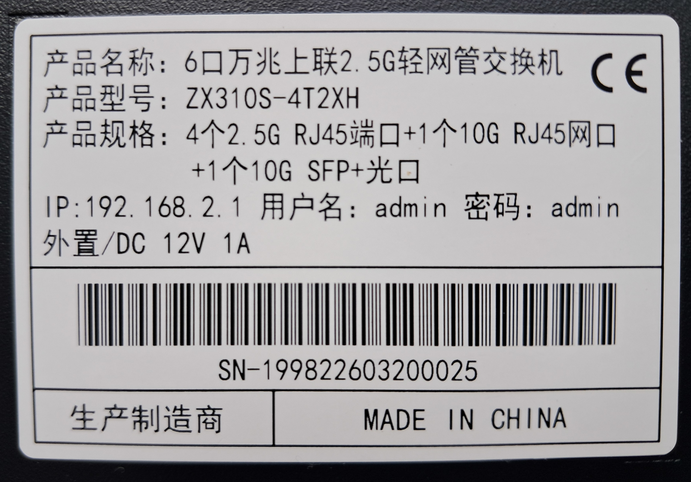
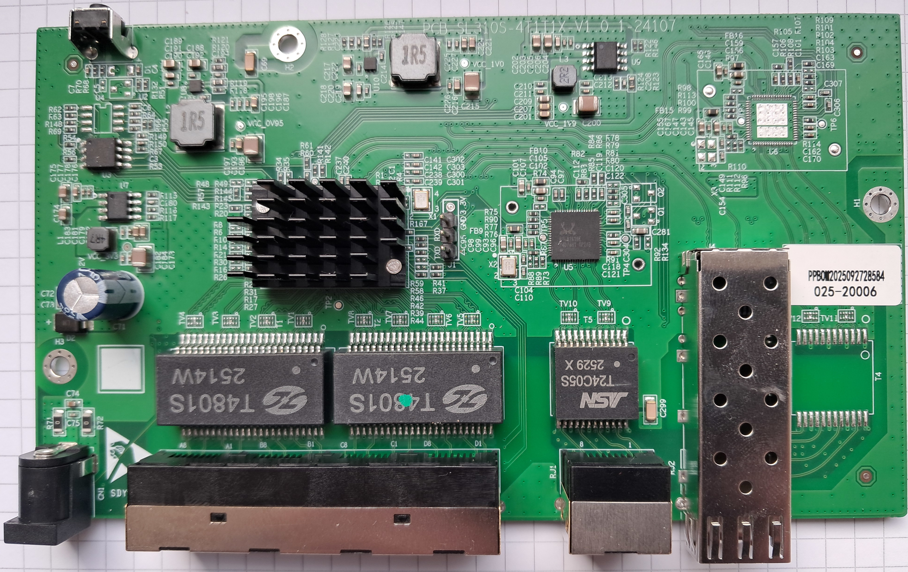
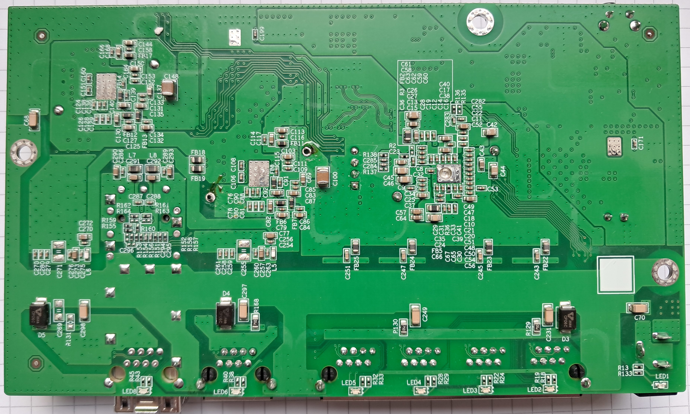

# ZX310S-4T2XH/

The following is a documentation for the managed switch marked as `ZX310S-4T2XH`
and sold by Horaco.

The original software is running UART on 57600 baud rate. The solder holes
of the UART header are filled in. In order to install a UART header, they
need to be cleared first. A 1.2mm drill can be used, alternatively a
de-soldering wick.
The original firmware uses 57600 baud 8N1

CPU: RTL8372
Flash: 2MByte Winbond W25Q16DV (U3)
PHY RTL8261BE

### Label specifications

- **Name**: 
- **Ports**:
  - 4 × RJ45: 10/100/1000/2500 Mbps
  - 1 x RJ45: 10/100/1000/2500/5000/10000 Mbps
  - 1 × SFP+: 1000 / 2500 / 10000 Mbps
- **Power**: 12V DC, 2A barrel connector 

### What works
The device is fully supported:
- All 4 2.5GBASE-T RJ45 ports work at 10/100/1000/2500 Mbps
- The 10GBit port works. TODO: Fix EEE, speed selection
- The SFP+ port supports 1G, 2.5G and 10G modules 
- LEDs work with the same indiciations as the OEM firmware

### PCB overview

**Board markings**
- Top silkscreen: PCB-SL310S-4T1T1X-V1.0.1-24107

Top side

Bottom

### J1, serial console

| `J1` pin | Signal      |
| -------- | ----------- |
| 1        | TX (Output) |
| 2        | RX (Input)  |
| 3        | GND         |
| 4        | 3V3         |

## Power supply

Input power is delivered via barell plug, `12V 2A` adapter was provided.
