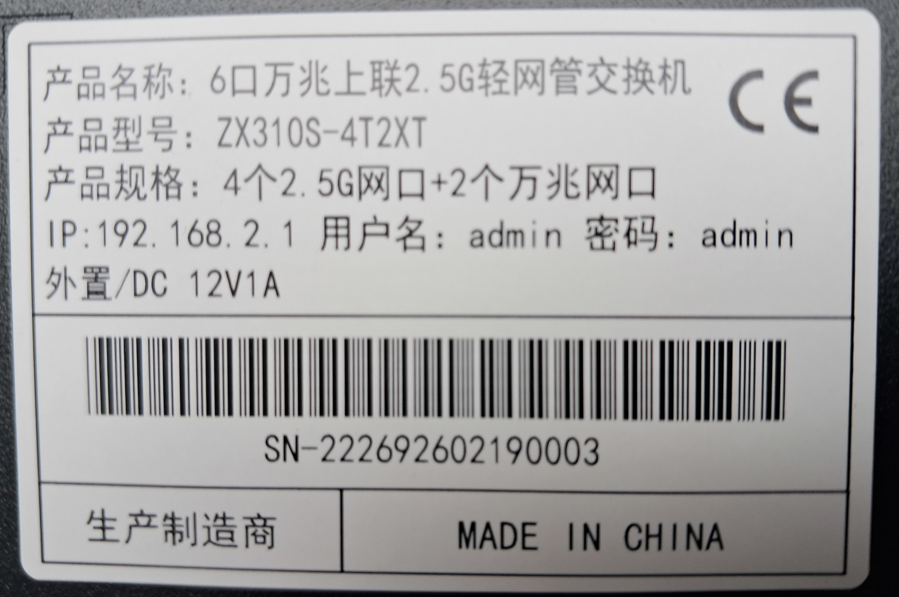
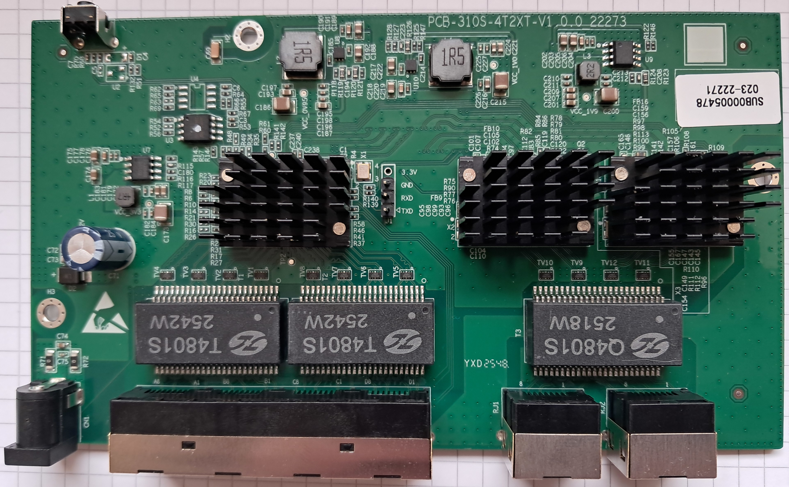
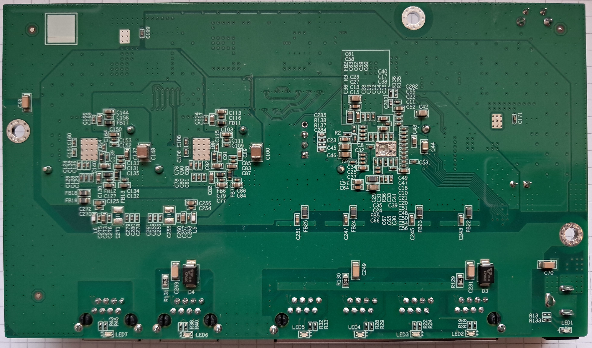

# ZX310S-4T2XT

The following is a documentation for the managed switch marked as
`ZX310S-4T2XT` and sold by Horaco.

The original software is running UART on 57600 baud rate 8N1.

CPU: RTL8372
Flash: 2MByte Winbond W25Q16DV (U3)
PHY 2x RTL8261BE

### Label specifications

- **Name**:
- **Ports**:
  - 4 × RJ45: 10/100/1000/2500 Mbps
  - 2 x RJ45: 10/100/1000/2500/5000/10000 Mbps
- **Power**: 12V DC, 2A barrel connector

### What works
The device is fully supported:
- All 4 2.5GBASE-T RJ45 ports work at 10/100/1000/2500 Mbps, including EEE
- The 10GBit ports works, including EEE.
- LEDs work with the same indiciations as the OEM firmware

### PCB overview

**Board markings**
- Top silkscreen: PCB-SL310S-4T2XT-V1.0.0-22273

Top side

Bottom

### J1, serial console

| `J1` pin | Signal      |
| -------- | ----------- |
| 1        | TX (Output) |
| 2        | RX (Input)  |
| 3        | GND         |
| 4        | 3V3         |

## Power supply

Input power is delivered via barell plug, `12V 2A` adapter was provided.
